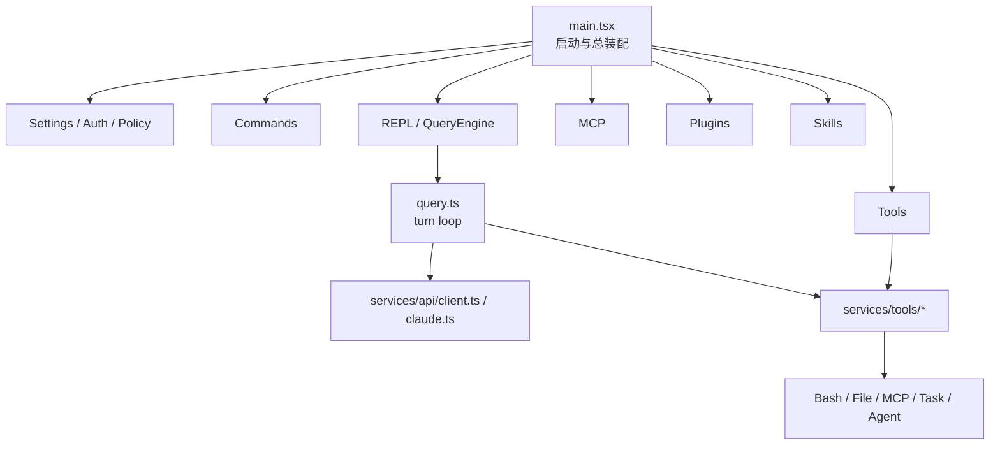
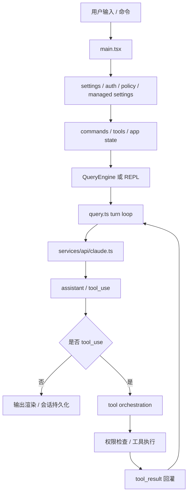
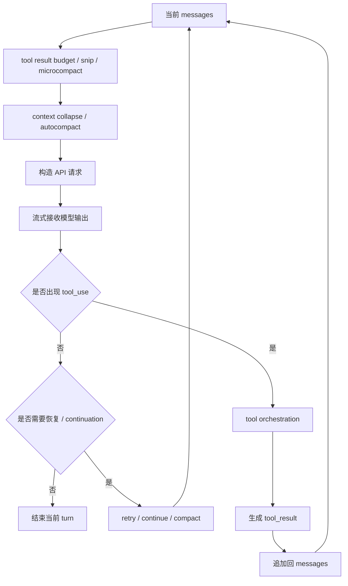
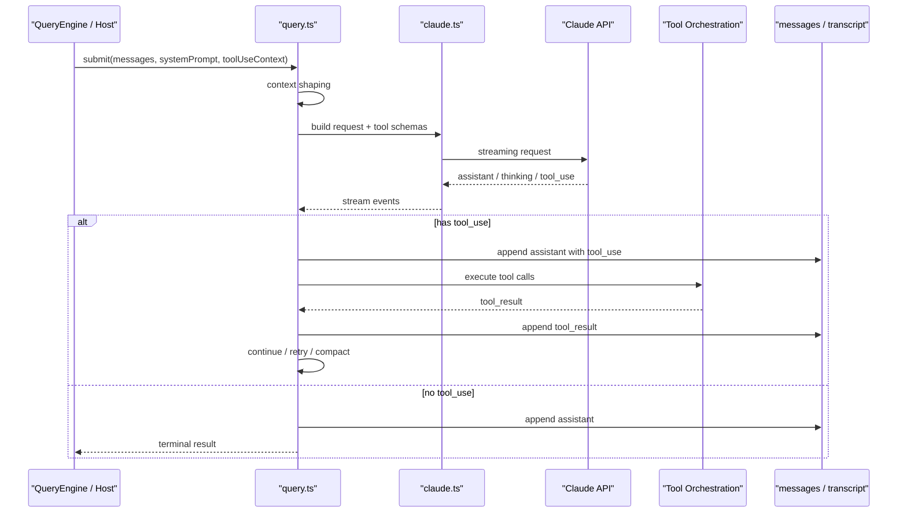
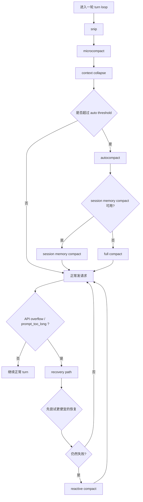
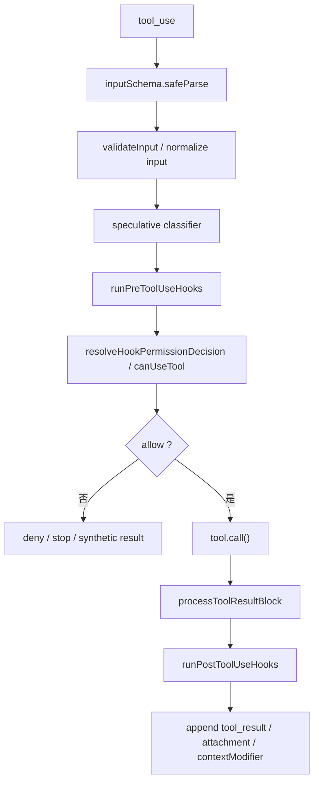
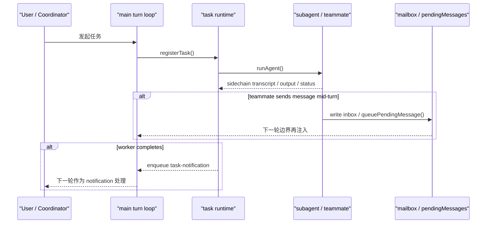

<!-- _class: lead -->

# Claude Code Source 代码走读

基于源码的 runtime 架构、主调用链与关键设计

- 重点：`turn loop`、`compact`、`tool execution`、`task runtime`
- 目标：先建立整体模型，再进入具体代码

---

<!-- _class: agenda -->

## 分享目录

- 这份仓库本质上是什么
- 架构总览与主执行链路
- `turn loop` 与 `conversation host`
- recovery、`compact` 与 context 装配
- tool execution、task runtime 与 mailbox
- 认证、策略、扩展系统与可观测性
- 最后总结与阅读建议

---

<!-- _class: lead -->

## 一、先建立整体模型

先回答两个问题：

- 这份仓库到底是什么
- 应该先从哪几层开始读

---

## 这份仓库本质上是什么

不是一个简单聊天 CLI，也不是薄薄的 SDK demo。

它更接近一个完整的本地 agent runtime：

- CLI / TUI 交互层
- 会话与状态管理层
- `turn loop` 与工具调用层
- 认证与 API 适配层
- 企业策略与远程托管层
- MCP / 插件 / Skills 扩展层

---

## 最值得先记住的入口文件

- [src/main.tsx](/Users/bobo/code/claude-code-source-code/src/main.tsx)：总入口与总装配
- [src/query.ts](/Users/bobo/code/claude-code-source-code/src/query.ts)：`turn loop` runtime kernel
- [src/QueryEngine.ts](/Users/bobo/code/claude-code-source-code/src/QueryEngine.ts)：`conversation host`
- [src/Tool.ts](/Users/bobo/code/claude-code-source-code/src/Tool.ts)：工具协议与 `ToolUseContext`
- [src/tools.ts](/Users/bobo/code/claude-code-source-code/src/tools.ts)：工具注册中心

---

<!-- _class: lead -->

## 二、先看主链路

从启动到一次完整 turn，先把系统怎么跑起来看清。

---

## 架构总览

结论：

- `main.tsx` 把系统装起来
- `query.ts` 让系统跑起来
- 其余模块决定系统能做什么、不能做什么

---

## 主执行链路

一句话：这是一个“模型调用”和“工具调用”反复往返的闭环。

---

## 启动阶段：先把 runtime surface 装好

`main.tsx` 启动时会一次性完成：

- 参数解析
- 认证预热
- settings 合并
- GrowthBook / telemetry 初始化
- remote managed settings 初始化
- policy limits 初始化
- commands / tools / MCP / skills 注册

重点不是“启动聊天”，而是先把整个 runtime surface 装好。

---

<!-- _class: lead -->

## 三、为什么 `query.ts` 是核心

真正把 Claude Code 变成 agent runtime 的，是 `turn loop`。

---

## 为什么 `query.ts` 是核心

`query.ts` 不是“一次 API 调用的包装层”，而是 Claude Code 的 `runtime kernel`。

它负责：

- 准备 `messages`
- 做 context 治理
- 发起模型请求
- 接收 streaming 输出
- 处理 `tool_use`
- 生成 `tool_result`
- 决定 continue / retry / compact / stop

---

## `turn loop` 的结构

这不是线性 pipeline，而是带 recovery 分支的 state machine。

---

## `turn loop` 时序

关键不是“模型说了什么”，而是“轨迹如何保持合法并继续推进”。

---

## `QueryEngine.ts`：`conversation host`

`QueryEngine.ts` 不是内核本身，而是 `conversation host`。

它更偏宿主职责：

- 保持多轮消息历史
- 聚合 usage
- 维护 permission denial
- 持有 `readFileState`
- 预落盘 transcript
- 做 SDK / headless 输出投影

可以简单记成：

- `query.ts` 负责一轮怎么跑
- `QueryEngine.ts` 负责一段会话怎么活

---

<!-- _class: lead -->

## 四、长会话为什么还能稳定工作

这部分的关键不是“回答更聪明”，而是 runtime 如何保住连续性。

---

## 为什么会话可以恢复

Claude Code 不是只把“聊天记录”写盘，而是在维护一条可恢复消息链。

关键文件：

- [src/utils/sessionStorage.ts](/Users/bobo/code/claude-code-source-code/src/utils/sessionStorage.ts)
- [src/utils/conversationRecovery.ts](/Users/bobo/code/claude-code-source-code/src/utils/conversationRecovery.ts)

恢复时做的不是简单反序列化，而是：

- 过滤 unresolved `tool_use`
- 过滤 orphaned thinking
- 必要时补 synthetic continuation
- 把历史修回 API 可接受状态

---

## 为什么大 tool result 不会拖垮上下文

关键机制是 `tool result budget / content replacement`。

它解决的不是“截断输出”，而是“冻结输出命运”：

- 某个 `tool_use_id` 一旦决定替换，后面必须始终替换
- 替换字符串必须稳定复用
- 恢复后也要重放相同 replacement

价值：

- 保护 prompt cache prefix
- 避免大输出反复塞爆上下文
- 让 long-running session 更稳定

---

## `compact`：分层整理，而不是一刀切摘要

当前 runtime 至少有这些路径：

- `microcompact`
- `snip`
- `context collapse`
- `autocompact`
- `reactive compact`
- 手动 `/compact`
- `session memory compact`

可以按两条轴来记：

- 主动整理 vs 被动恢复
- 轻量缩减 vs full compaction

---

## `compact` 触发顺序与优先级

---

## full `compact` 后到底保留什么

压缩后并不只剩一段 summary，还会尽量保留当前工作面：

- `compact boundary`
- `summary`
- `messagesToKeep`
- 文件恢复 attachment
- `plan_mode` 相关 attachment
- `invoked_skills`
- deferred tools / agent listing / MCP delta
- hook results

所以 Claude Code 的 `compact` 更像“重建可继续工作的最小 context”。

---

## Skills 如何进入 context

Skills 不是普通文档，而是结构化能力单元。

大致分 3 步：

1. 启动时加载静态 skills
2. 文件操作时动态发现 / 激活 conditional skills
3. 真正调用 skill 时，把正文展开进 context

所以要区分两层：

- skill 被扫描到：capability 可见
- skill 被调用：content 真正进入 context

---

## `attachments.ts`：按 turn 重建工作面

`attachments.ts` 不是“附件工具箱”，更像 context router。

它会按 turn 动态注入：

- `relevant_memories`
- `dynamic_skill`
- `plan_mode`
- `deferred_tools_delta`
- `mcp_instructions_delta`
- `teammate_mailbox`
- `todo_reminders`

结论：

- 不是所有关键上下文都常驻在 `messages`
- 很多运行时信息是按 turn 临时重新拼进来的

---

<!-- _class: lead -->

## 五、执行能力并不只来自模型

Claude Code 的“执行力”来自 tool pipeline 和 async runtime。

---

## tool call 不是直接执行

真正的 tool execution 是一条 policy pipeline：

重点：autonomy boundary 在 tool pipeline，而不在 UI 表面。

---

## task / subagent / mailbox 是异步执行底座

这块已经不像“顺手起个后台任务”，而是一层独立 substrate：

- `Task.ts`：统一 task 类型和生命周期
- `task/framework.ts`：注册、轮询、GC、notification
- `runAgent.ts`：subagent、sidechain transcript、metadata
- `teammateMailbox.ts`：显式 mailbox 协议

也就是说，agent / teammate 已经是有 identity、有 transcript、有恢复路径的执行体。

---

## mailbox / `task-notification` 的协作语义

这套设计牺牲了一点即时性，换来了 turn 内状态一致性。

---

## 关键状态载体

理解 Claude Code，最好同时看这几类状态：

- `messages`：turn-local 工作面
- transcript / sidechain：durable history
- `ToolUseContext`：工具执行总线
- `AppState`：宿主共享状态
- attachments / sidecar artifacts：按需重注入的工作面

不要把系统简化成“只有消息数组”。

---

<!-- _class: lead -->

## 六、为什么它更像产品化 runtime

最后再看控制面、扩展面和可观测性。

---

## 认证、策略和服务端控制

这一层的结论很直接：

- 服务端负责裁决
- 客户端负责执行

主要控制面包括：

- OAuth / API key / third-party provider 认证
- `policy_limits`
- remote managed settings
- `forceLoginOrgUUID`

所以更准确地说，不是“客户端封用户”，而是“服务端决定，客户端落实”。

---

## API、Prompt 与扩展系统

还需要单独记住三件事：

- `client.ts` / `claude.ts` 不是薄封装，而是多 provider 统一适配层
- prompt stack 在这里是一层 `control plane`
- MCP / plugins / commands / skills 都是一级扩展面

这也是为什么这份代码看起来更像完整 runtime，而不是一个单点功能工具。

---

## 可观测性为什么重要

这套 runtime 不只是“会跑”，还在尝试解释自己为什么这样跑。

重点文件：

- [src/utils/queryProfiler.ts](/Users/bobo/code/claude-code-source-code/src/utils/queryProfiler.ts)
- [src/utils/analyzeContext.ts](/Users/bobo/code/claude-code-source-code/src/utils/analyzeContext.ts)
- [src/services/api/promptCacheBreakDetection.ts](/Users/bobo/code/claude-code-source-code/src/services/api/promptCacheBreakDetection.ts)

它们分别回答：

- 慢在哪个阶段
- 上下文是谁吃掉的
- cache 为什么断了

---

<!-- _class: lead -->

## 七、给读者的落点

最后只保留最应该带走的结论。

---

## 从源码提炼的使用建议

高质量任务描述最好包含 4 部分：

- 目标
- 范围
- 约束
- 验证

最通用的一句增强指令是：

> 先读相关代码再改；优先复用现有实现；做最小必要改动；验证后如实汇报。

---

<!-- _class: summary -->

## 最后总结

如果只用一句话概括：

Claude Code 本质上是一个围绕 `LLM turn loop` 构建的、可被企业管理的、可扩展的终端 agent runtime。

最值得先抓住的三条线：

- `main.tsx -> query.ts -> tools`
- `settings -> auth -> api client`
- `policy / managed settings -> 本地执行`

