# Claude Code Source 代码走读

本文档从工程实现角度梳理这份仓库的结构、主调用链和关键设计。目标不是复述 README，而是先帮读者建立 runtime 模型，再顺着主链路进入具体代码。

## 导览图

### 架构总览

先看这张图，只抓整体分层，不用纠结实现细节。阅读重点是：

- `main.tsx` 是总装配入口
- `query.ts` 是 turn loop 核心
- 其余模块大多是在提供能力、状态或约束

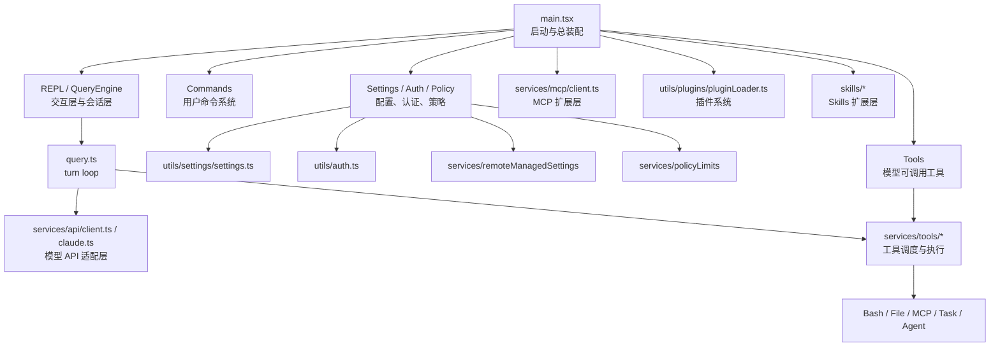

如果只想先建立一个粗模型，可以把它记成一句话：`main.tsx` 把系统装起来，`query.ts` 让系统跑起来，周边模块决定系统能做什么、不能做什么。

### 主执行链路

第二张图比第一张更偏运行时。这里重点看中间那条闭环：

- 用户输入进入 `main.tsx`
- `query.ts` 调模型
- 模型如果发出 `tool_use`，就进入 tool execution
- `tool_result` 再回到 `query.ts`
- 然后继续下一轮

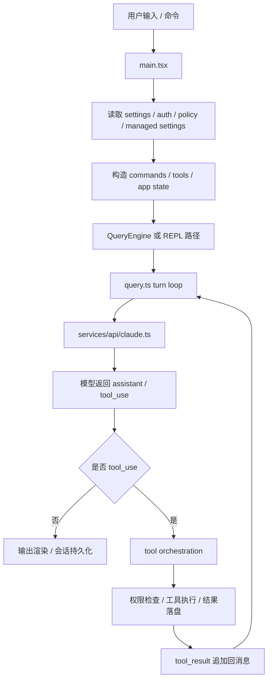

后面正文基本就是把这条链按模块拆开讲。

## 1. 先给结论：这个仓库是什么

这一节先不讲细节，只回答两个问题：这份仓库本质上是什么，以及最值得先记住哪些入口文件。

这不是一个简单的聊天 CLI，也不是一份薄薄的 SDK demo。它更接近一个完整的本地代理运行时，核心由六层组成：

- CLI 与终端交互层
- 会话与状态管理层
- LLM turn loop 与工具调用层
- 认证与 API 适配层
- 企业策略与远程托管配置层
- MCP / 插件 / Skills 扩展层

读这份仓库时，可以先记住五个核心文件：

- [src/main.tsx](/Users/bobo/code/claude-code-source-code/src/main.tsx)：总入口与总装配
- [src/query.ts](/Users/bobo/code/claude-code-source-code/src/query.ts)：单次 agent loop 执行内核
- [src/QueryEngine.ts](/Users/bobo/code/claude-code-source-code/src/QueryEngine.ts)：多轮会话封装
- [src/Tool.ts](/Users/bobo/code/claude-code-source-code/src/Tool.ts) 和 [src/tools.ts](/Users/bobo/code/claude-code-source-code/src/tools.ts)：工具协议与注册中心
- [src/services/*](/Users/bobo/code/claude-code-source-code/src/services/)：API、MCP、策略、分析、插件等产品化能力

## 2. 阅读地图

这一节给第一次读仓库的人一个最省力的进入顺序。核心原则是：先抓主链路，再看扩展面。

如果是第一次进入仓库，建议按下面顺序读：

1. [src/main.tsx](/Users/bobo/code/claude-code-source-code/src/main.tsx)
2. [src/query.ts](/Users/bobo/code/claude-code-source-code/src/query.ts)
3. [src/QueryEngine.ts](/Users/bobo/code/claude-code-source-code/src/QueryEngine.ts)
4. [src/Tool.ts](/Users/bobo/code/claude-code-source-code/src/Tool.ts)
5. [src/tools.ts](/Users/bobo/code/claude-code-source-code/src/tools.ts)
6. [src/tools/BashTool/BashTool.tsx](/Users/bobo/code/claude-code-source-code/src/tools/BashTool/BashTool.tsx)
7. [src/services/api/client.ts](/Users/bobo/code/claude-code-source-code/src/services/api/client.ts)
8. [src/services/api/claude.ts](/Users/bobo/code/claude-code-source-code/src/services/api/claude.ts)
9. [src/utils/auth.ts](/Users/bobo/code/claude-code-source-code/src/utils/auth.ts)
10. [src/utils/settings/settings.ts](/Users/bobo/code/claude-code-source-code/src/utils/settings/settings.ts)
11. [src/services/remoteManagedSettings/index.ts](/Users/bobo/code/claude-code-source-code/src/services/remoteManagedSettings/index.ts)
12. [src/services/policyLimits/index.ts](/Users/bobo/code/claude-code-source-code/src/services/policyLimits/index.ts)
13. [src/services/mcp/client.ts](/Users/bobo/code/claude-code-source-code/src/services/mcp/client.ts)
14. [src/utils/plugins/pluginLoader.ts](/Users/bobo/code/claude-code-source-code/src/utils/plugins/pluginLoader.ts)
15. [src/commands.ts](/Users/bobo/code/claude-code-source-code/src/commands.ts)

阅读顺序上，建议先抓“主链路”，再看子系统；先看启动、认证、请求、tool execution 回路，再看插件、MCP 和控制相关模块。

## 3. 启动与主链路

这一节回答的是：Claude Code 从启动到真正进入一次 turn，最核心的装配步骤是什么。

### 3.1 顶层目录怎么分工

关键目录如下：

- `src/`：主体源码
- `docs/`：分析文档
- `scripts/`：构建与源码处理脚本
- `stubs/`：Bun 编译期能力的 stub
- `vendor/`：原生能力或构建依赖的占位源码

`src/` 下的重要子目录：

- `commands/`：Slash commands 与 CLI 子命令
- `tools/`：模型可调用工具
- `services/`：API / MCP / analytics / policy / plugins
- `components/`, `screens/`, `ink/`：TUI 与 React/Ink 交互层
- `utils/`：大量核心辅助逻辑
- `skills/`, `plugins/`：扩展生态
- `tasks/`：本地/远程任务系统
- `bridge/`, `remote/`：远程控制与远程会话

### 3.2 `main.tsx` 在启动时做什么

主入口是 [src/main.tsx](/Users/bobo/code/claude-code-source-code/src/main.tsx)。它承担的工作远超“解析参数后开始聊天”：

1. 启动前置 side effects
2. 预取 keychain / MDM / 本地配置
3. 初始化 telemetry、GrowthBook、远程配置
4. 初始化插件、技能、MCP
5. 读取设置并合并多来源配置
6. 初始化命令、工具、权限模式
7. 进入 REPL 或 headless / print 模式

文件顶部还专门提前触发一些昂贵操作，例如 keychain 预热和 MDM 读取，说明启动性能是认真优化过的。

### 3.3 一次完整请求怎么跑

把图展开成人话，完整链路基本是这样：

#### 阶段 A：启动与环境准备

`main.tsx` 在最前面完成：

- 参数解析
- 认证预热
- settings 合并
- GrowthBook 初始化
- remote managed settings 初始化
- policy limits 初始化
- commands / tools 注册

这一步会决定后续运行期的能力边界。

#### 阶段 B：构造会话执行上下文

进入对话前，系统会准备：

- `messages`
- `systemPrompt`
- `ToolUseContext`
- `permissionContext`
- `MCP clients`
- `agents`
- `readFileCache`

这一层主要由 [src/main.tsx](/Users/bobo/code/claude-code-source-code/src/main.tsx)、[src/QueryEngine.ts](/Users/bobo/code/claude-code-source-code/src/QueryEngine.ts) 和 [src/Tool.ts](/Users/bobo/code/claude-code-source-code/src/Tool.ts) 共同完成。

#### 阶段 C：turn loop 向模型发请求

`query.ts` 调 API 层时，会：

- 规范化内部消息结构
- 注入 system prompt
- 附带工具 schema
- 设置 thinking / effort / task budget / prompt caching
- 调用 `getAnthropicClient()`

涉及文件：

- [src/query.ts](/Users/bobo/code/claude-code-source-code/src/query.ts)
- [src/services/api/claude.ts](/Users/bobo/code/claude-code-source-code/src/services/api/claude.ts)
- [src/services/api/client.ts](/Users/bobo/code/claude-code-source-code/src/services/api/client.ts)

#### 阶段 D：限制在请求前、中、后持续生效

限制不是只在 UI 层生效，而是贯穿整个调用链：

- 请求前：认证是否有效、provider 是否允许、policy 是否关闭能力
- 请求中：工具权限检查、sandbox / 路径约束、managed settings 控制的 hooks / plugin / MCP 行为
- 请求后：认证错误翻译、401 恢复、被关闭能力直接报错或退出

#### 阶段 E：tool execution 回路

当模型返回 `tool_use` 时，系统会：

1. 根据工具名找到实现
2. 校验输入 schema
3. 调用 `canUseTool`
4. 根据并发安全性决定串行或并行
5. 执行工具并生成 `tool_result`
6. 把结果消息追加回会话
7. 重新回到 turn loop

这就是这套代码真正的代理闭环。

### 3.4 发生问题时先查什么

如果想定位“为什么这个功能不能用”或“为什么行为和预期不同”，建议按这个顺序排查：

1. 当前认证源是什么
2. 当前 account / org / subscription 是什么
3. policy limits 是否命中
4. remote managed settings 是否生效
5. 命令或工具是否被 feature flag / settings 裁掉
6. 权限上下文是否拒绝了工具
7. 工具实现本身是否触发 sandbox / path / read-only 校验

## 4. 核心执行层

这一节是全文重点，回答的是：Claude Code 的 runtime kernel 到底怎么跑，为什么它不像一个简单的聊天 CLI。

### 4.1 `query.ts`：turn loop

文件： [src/query.ts](/Users/bobo/code/claude-code-source-code/src/query.ts)

`query()` / `queryLoop()` 负责一轮或多轮代理执行：

- 准备消息
- 发送到模型
- 流式接收结果
- 发现 `tool_use`
- 调工具
- 把 `tool_result` 追加回消息
- 继续下一轮直到终止

它不是最小 demo 闭环，而是生产强化版闭环。相比最小 agent loop，这里还多了很多真实运行时逻辑：

- auto compact
- token warning 与 output 限额恢复
- prompt too long 恢复
- tool result summary
- session storage
- hooks
- message queue
- budget control
- feature-gated compaction / snip / classifier 等能力

更关键的是，它的形状并不像“采样 -> 工具 -> 返回”的线性 pipeline，而更像一张恢复图。除了 `messages`，它还显式维护或隐式依赖很多跨 iteration 状态，例如：

- compact / continue 的原因
- pending tool summary
- stop hook 是否处于激活态
- max output token 恢复次数
- auto compact 跟踪状态

这也是为什么 `query.ts` 读起来会比普通 agent loop 重很多。它实际维护的是一条“可继续、可恢复、可压缩、可回放”的合法轨迹，而不只是文本输出。

#### turn loop 到底怎么推进

如果只抓最关键的执行路径，可以把 `queryLoop()` 理解成下面这条循环：

1. 从当前 `messages` 中取出最近一次 compact boundary 之后的可见历史
2. 先做几轮“上下文治理”：
   - tool result budget 替换
   - snip
   - microcompact
   - context collapse
   - autocompact
3. 用处理后的消息构造本轮 API 请求
4. 流式接收模型输出
5. 一边收流，一边收集：
   - assistant text / thinking
   - `tool_use`
   - stop reason
6. 如果有 `tool_use`，进入工具执行器
7. 生成 `tool_result` 后追加回消息
8. 根据结果决定：
   - 继续下一轮
   - 做 compact / retry / continuation
   - 结束本次 turn

先看下面这张 flowchart。它表达的是 turn loop 的结构，不是精确时序：

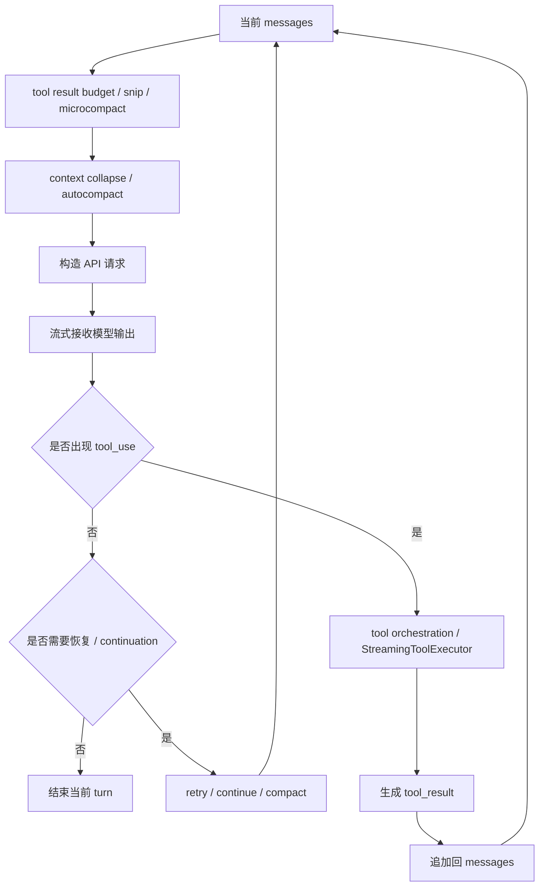

阅读这张图时，可以分三段理解：

- 左边：发请求之前如何整理 context
- 中间：如何调用模型并接收流式结果
- 右边：一旦出现 `tool_use`，怎样执行工具并把结果写回消息

再看下面这张 sequence diagram，它表达的是同一个 turn 里真正的往返关系：

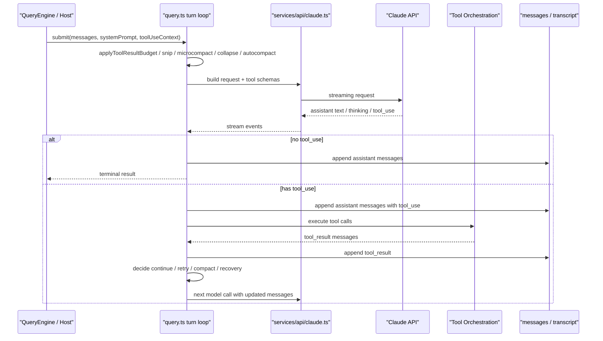

如果前一张图是“结构图”，这一张就是“动作图”。它说明 Claude Code 的核心不是一次 API 调用，而是两类往返被稳定串起来：

- `turn loop -> API -> model`
- `turn loop -> tool executor -> messages`

从实现上看，这条链主要落在：

- [src/query.ts](/Users/bobo/code/claude-code-source-code/src/query.ts)
- [src/services/api/claude.ts](/Users/bobo/code/claude-code-source-code/src/services/api/claude.ts)
- [src/services/tools/toolOrchestration.ts](/Users/bobo/code/claude-code-source-code/src/services/tools/toolOrchestration.ts)
- [src/services/tools/StreamingToolExecutor.ts](/Users/bobo/code/claude-code-source-code/src/services/tools/StreamingToolExecutor.ts)

#### 为什么它是 Claude Code 的核心

这块逻辑之所以重要，是因为 Claude Code 的产品价值并不只在“模型能回答”，而在“模型能持续工作”。`turn loop` 正是把这些能力串起来的 runtime kernel：

- 模型回答不是终点，`tool_use -> tool_result -> 再次采样` 才是闭环
- 错误不是直接失败，而是先尝试恢复
- 上下文不是越积越长，而是持续整理、裁剪、压缩
- 会话不是一坨字符串，而是一条尽量合法、可恢复的轨迹

如果只读一个文件来理解 Claude Code 的运行时，我会优先读 [src/query.ts](/Users/bobo/code/claude-code-source-code/src/query.ts)。

#### turn loop 真正维护的几个约束

从代码上看，这个循环最在意的不是“尽快出答案”，而是下面几件事：

- `tool_use` 和 `tool_result` 不能断配  
  API 对消息拓扑要求很严格，所以循环里一直在防止悬空 `tool_use`、意外重复、恢复后 orphaned result。
- thinking / assistant trajectory 不能被随意截断  
  这也是为什么很多恢复逻辑看起来很绕，本质上是在保住合法消息序列。
- 上下文过长时优先恢复而不是直接失败  
  顺序通常是先做更便宜的整理，再做更重的 compact。
- stop hook、tool summary、budget 都是 loop 内状态，而不是外层装饰  
  这说明它确实是 runtime kernel，而不是一次性 request wrapper。

#### 一个 turn 内的 recovery 分支

`query.ts` 最不像 demo 的地方，是它把很多“失败后怎么办”内建进了 turn loop。比较典型的分支包括：

- `prompt_too_long`
- `max_output_tokens`
- context collapse drain retry
- reactive compact retry
- stop hook blocking 后重试
- continuation / synthetic continue

所以更准确地说，它不是简单的 `while (needsFollowUp)`，而是一台带恢复分支的 turn state machine，只是状态没有完全显式化成独立模型。

### 4.2 `QueryEngine.ts`：conversation host

文件： [src/QueryEngine.ts](/Users/bobo/code/claude-code-source-code/src/QueryEngine.ts)

它把 `query.ts` 抽象成一个面向 SDK / headless 使用的会话对象，核心职责包括：

- 保持会话消息历史
- 维护 permission denial 记录
- 维护 file read state
- 累积 usage
- 多轮复用同一个对话上下文

从更高层看，它不是内核本身，而是会话宿主。两者关系可以简单理解为：

- `query.ts` 更像一次 turn 的执行机
- `QueryEngine.ts` 更像一次 conversation 的控制器

这个区分很重要，因为很多宿主级职责并不在 `query.ts` 里，例如：

- transcript 预落盘
- headless / SDK 投影
- usage 聚合
- permission denial 的跨 turn 记录
- nested memory / discovered skills 的宿主持有

### 4.3 transcript / recovery：为什么会话可以恢复

这一节回答一个核心问题：Claude Code 为什么不是“消息数组断了就没了”，而是能在中断、compact、resume 之后继续工作。

关键文件主要是：

- [src/utils/sessionStorage.ts](/Users/bobo/code/claude-code-source-code/src/utils/sessionStorage.ts)
- [src/utils/conversationRecovery.ts](/Users/bobo/code/claude-code-source-code/src/utils/conversationRecovery.ts)
- [src/QueryEngine.ts](/Users/bobo/code/claude-code-source-code/src/QueryEngine.ts)

#### transcript 在磁盘上存的不是普通聊天记录

从 `sessionStorage.ts` 看，Claude Code 持久化的不只是“用户说了什么、assistant 回了什么”，而是一条带 `parentUuid` 的消息链。几个关键点是：

- transcript message 和 progress message 被明确区分  
  progress 是 UI 临时状态，不应该进入主链。
- 只有真正参与因果链的消息才进入 `parentUuid` 链  
  否则 resume 时会把显示层噪音也当成会话拓扑的一部分。
- compact boundary 也是 transcript 的一部分  
  它不是 UI 提示，而是恢复协议的一部分。

这里最值得注意的是：Claude Code 持久化的目标不是“把历史存下来”，而是“把一条还能重建的会话链存下来”。

#### resume 时不是直接反序列化，而是先做修复

`conversationRecovery.ts` 做的事情远不只是 `JSON.parse`。恢复时至少会经过这些步骤：

1. 读取 transcript / log
2. 恢复 skill state、plan、file history 等 sidecar 状态
3. 过滤 unresolved `tool_use`
4. 过滤 orphaned thinking-only assistant messages
5. 过滤只剩空白的 assistant 消息
6. 检测这轮是正常结束、还是中断在半途中
7. 必要时插入 synthetic continuation
8. 保证恢复后的消息序列重新变成 API 可接受的形态

也就是说，恢复的目标不是“忠实还原磁盘内容”，而是“把系统重新放回可运行状态”。

#### 为什么会有 synthetic continuation

这块在代码里很关键。恢复时，如果系统判断上一轮是半途中断，就不会简单停在断点上，而是补一条类似“Continue from where you left off.” 的 synthetic user message，再让 turn loop 继续。

这意味着：

- 中断本身会被转换成一种可继续的状态
- turn loop 接到的不是“坏掉的历史”，而是“带 continuation 的合法输入”

这也是为什么 resume 行为看起来不像“回放聊天”，更像“重新接管一个未完成的 runtime”。

#### compact boundary 在恢复里起什么作用

compact boundary 的作用不只是给 UI 看“这里压缩过”。在恢复视角下，它至少承担三件事：

- 标记 pre-compact 历史和 post-compact 历史的边界
- 携带 compact metadata，帮助后续恢复或投影
- 让加载逻辑知道哪些消息已经被 summary 替代，不应该再按原方式参与主链

这就是为什么文档前面一直强调 compact 不是普通摘要，而是运行时状态转换。

#### 可以把 recovery 理解成什么

如果要一句话概括，可以把它理解成：

- transcript 提供“可追溯历史”
- recovery 把它修回“可继续运行的当前状态”

也正因为如此，`sessionStorage.ts` 和 `conversationRecovery.ts` 值得单独读，它们代表的是 Claude Code 的 durable runtime 一面，而不是普通聊天记录存档。

### 4.4 tool result budget / content replacement：为什么大输出不会拖垮上下文

这一节回答另一个很关键的问题：Claude Code 为什么能在工具输出很大时继续稳定工作，而不是每轮都把上下文塞爆。

关键文件主要是：

- [src/utils/toolResultStorage.ts](/Users/bobo/code/claude-code-source-code/src/utils/toolResultStorage.ts)
- [src/services/compact/microCompact.ts](/Users/bobo/code/claude-code-source-code/src/services/compact/microCompact.ts)
- [src/services/api/claude.ts](/Users/bobo/code/claude-code-source-code/src/services/api/claude.ts)

#### 这块解决的不是“截断输出”，而是“冻结输出命运”

`toolResultStorage.ts` 里最重要的不是把大输出写文件，而是这套状态：

- `seenIds`
- `replacements`

它表达的核心约束是：

- 某个 `tool_use_id` 一旦进入预算判断，它后续是否替换就被冻结
- 已经替换过的结果，后面必须反复使用完全相同的 replacement string
- 没替换过的结果，后面也不能突然改成替换

这样做的目的不是简单省 token，而是保护 prompt cache prefix 的稳定性。

#### 大 tool result 是怎么被处理的

当单个 tool result 很大时，系统不会先粗暴截断，而是优先：

1. 把完整结果写到 session 目录下的文件
2. 生成一个固定格式的 preview message
3. 在消息里用这个 preview 替换原始大输出

也就是说，模型看到的是：

- 文件路径
- preview
- 明确的“完整结果已持久化”提示

而不是一段随机截断的文本。

#### per-tool limit 和 per-message budget 是两层机制

这块很容易混，代码里实际上有两层：

- per-tool limit  
  单个工具自己的结果过大时，会先被持久化替换。
- per-message aggregate budget  
  即使单个 tool result 没超过 per-tool limit，多个 `tool_result` 合并到一个 wire-level user message 后，整体还是可能太大；这时会按 message-level budget 再做一层替换。

第二层尤其重要，因为 API 层会合并连续 user messages。如果只按单个 block 看，很多过载场景根本抓不住。

#### 为什么 resume 后 replacement 还能稳定

因为 replacement 决策不是临时算完就丢，而是会作为 record 持久化。恢复时，系统会：

- 根据 transcript 中的 replacement records 重建 replacement state
- 对已经替换过的 `tool_use_id` 重新应用同一份 replacement string
- 对只看过但没替换的结果保持 frozen，不再改变命运

这让 Claude Code 的 tool output 管理具备了一个很少见但很重要的属性：跨 resume 的 prefix stability。

#### 这块和 compact 的关系

`tool result budget`、`microcompact`、full `compact` 是三层不同但互相配合的机制：

- `tool result budget`  
  先控制超大输出如何进入消息。
- `microcompact`  
  在请求前轻量清掉一部分旧 tool result 占用。
- full `compact`  
  真正把较长历史换成 summary + attachments。

它们不是互斥关系，而是 runtime 在不同时间点做的不同级别上下文治理。

#### 为什么这一层很值钱

很多 demo agent 只会在上下文过长时“压缩历史”，但 Claude Code 这里多做了一层更细的工作：

- 大输出先外化到磁盘
- replacement string 稳定复用
- 恢复后还要保证同样的决定被重放

这让它更像一个真正长期运行的 agent runtime，而不是“一轮一轮把大文本塞进上下文”的脚本。

### 4.5 compact：context compaction 是怎么工作的

Claude Code 不是等上下文爆掉才简单截断，而是有一整套分层 compaction 路径。核心文件主要是：

- [src/services/compact/autoCompact.ts](/Users/bobo/code/claude-code-source-code/src/services/compact/autoCompact.ts)
- [src/services/compact/compact.ts](/Users/bobo/code/claude-code-source-code/src/services/compact/compact.ts)
- [src/services/compact/microCompact.ts](/Users/bobo/code/claude-code-source-code/src/services/compact/microCompact.ts)
- [src/services/compact/sessionMemoryCompact.ts](/Users/bobo/code/claude-code-source-code/src/services/compact/sessionMemoryCompact.ts)
- [src/services/compact/postCompactCleanup.ts](/Users/bobo/code/claude-code-source-code/src/services/compact/postCompactCleanup.ts)

先区分三种不同层级：

- `microcompact`：轻量级、尽量不改主消息结构，主要清理大工具结果
- `autocompact` / 手动 `/compact`：真正生成摘要，重建 post-compact 消息
- `reactive compact`：在已经出现 `prompt_too_long` 之后触发的补救压缩

#### 各种 compact 的触发条件

这一块很容易混，因为代码里不只有一种 compact。更准确地说，当前 runtime 至少有 6 条相关路径：

##### 1. `microcompact`

触发特点：

- 在 `query.ts` 里几乎每轮都会先经过这一步
- 但它通常只会对“可 compact 的工具结果”生效
- 重点不是总结整段会话，而是缩减大 tool result 的占用

可以把它理解成“请求前的轻量整理”，不是完整的 conversation compaction。

##### 2. `snip`

触发特点：

- 在 `microcompact` 之前执行
- 主要用于按历史裁剪规则移除一部分旧消息
- 只有相关 feature 打开时才会生效

它更像一种 history trimming，而不是 summary-based compaction。

##### 3. `context collapse`

触发特点：

- 在 `microcompact` 之后、`autocompact` 之前尝试
- 目标是先用更便宜的 collapse 保住更细粒度的上下文
- 只有对应 capability 开启时才参与 overflow 恢复链路

从 `query.ts` 的顺序看，它的优先级高于 full autocompact，因为它尽量不把历史一次性压成单个 summary。

##### 4. `autocompact`

触发特点：

- 按 token threshold 主动触发
- 只有 auto-compact 开启时才会跑
- 它发生在真正撞到 API 极限之前，属于 proactive compaction

在 [src/services/compact/autoCompact.ts](/Users/bobo/code/claude-code-source-code/src/services/compact/autoCompact.ts) 里，是否触发主要取决于：

- 当前 token 估算是否超过 autocompact threshold
- 当前 query source 是否允许 autocompact
- 是否已经因为失败次数过多触发 circuit breaker
- 是否被 reactive-only / context-collapse 模式压制

##### 5. `reactive compact`

触发特点：

- 在已经出现 `prompt_too_long` 或类似 overflow 错误后才触发
- 属于 recovery path，不是 proactive path
- 通常在更便宜的恢复动作之后才会进入

也就是说，`reactive compact` 的前提不是“token 快满了”，而是“这轮已经失败了，需要靠 compact 把 loop 拉回来”。

##### 6. 手动 `/compact`

触发特点：

- 只有用户显式调用 slash command 时触发
- 不依赖 autocompact threshold
- 走的是 full compaction 路径，但触发来源是用户，而不是 runtime 自动判断

这条路径更像“人工控制上下文整形”。

##### 7. `session memory compact`

触发特点：

- 它是 autocompact 路径中的一个替代分支
- 只有相关实验开关与 session memory 条件满足时才会尝试
- 如果不满足条件，会回退到 legacy full compact

它的目标不是简单总结，而是优先借助 session memory 这类外化工件完成 compaction。

#### 可以怎么记这些触发条件

如果想快速记住，可以按“轻重”和“主动/被动”两条轴来分：

- 轻量、主动：`microcompact`
- 裁剪、主动：`snip`
- 结构化整理、主动：`context collapse`
- 完整摘要、主动：`autocompact`
- 完整摘要、被动恢复：`reactive compact`
- 完整摘要、人工触发：`/compact`
- session-memory 优先的替代分支：`session memory compact`

这样读 `query.ts` 和 `autoCompact.ts` 时，就不会把所有 compact 逻辑看成同一种东西。

下面这张图把它们放回 runtime 顺序里看，会更直观一些：

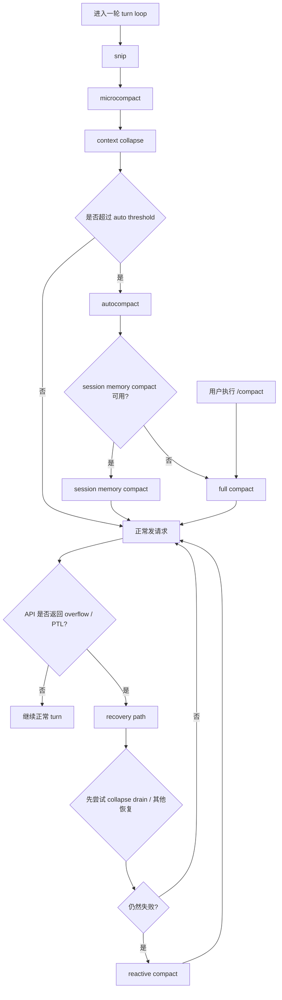

这张图的阅读重点是：

- `snip -> microcompact -> context collapse -> autocompact` 是请求前的主动整理链
- `reactive compact` 是请求失败后的恢复链
- `/compact` 是用户直接触发 full compact 的旁路
- `session memory compact` 不是单独一套主流程，而是 autocompact 内可能选中的替代分支

#### 每次 full compact 的大致流程

真正的 full compact 可以概括成：

1. 选出要 compaction 的历史消息
2. 先做预处理：
   - 去掉会浪费预算的附件类型
   - 对图片/文档做占位替换
3. 调 compact summarizer 生成摘要
4. 清理或重置一部分本地缓存状态
5. 生成 post-compact 附件与边界消息
6. 把 compaction 后的消息重新拼成新的消息数组

先看下面这张图。它讲的是一次 full compact 的内部流水线：

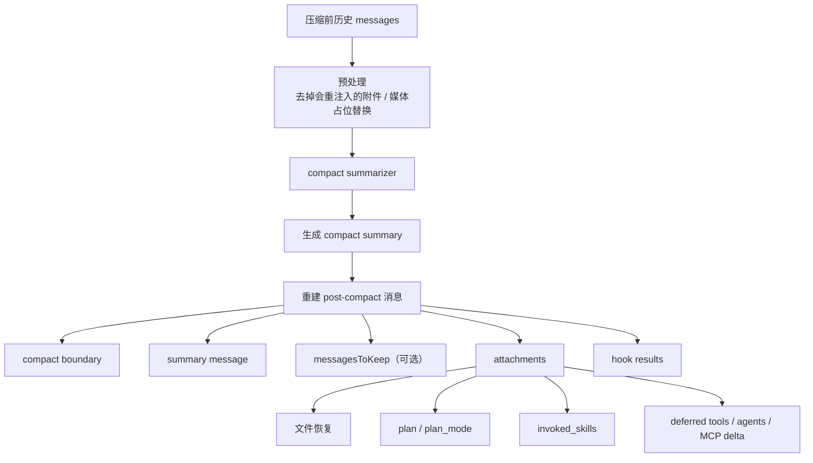

这张图可以分两半读：

- 上半段：把旧历史压成 compact summary
- 下半段：把 summary 重新包装成一个还能继续工作的 post-compact context

其中最关键的不是 `summary`，而是后面的 `attachments`。Claude Code 的 compact 不是“做完摘要就结束”，而是要重建工作面。

在 [src/services/compact/compact.ts](/Users/bobo/code/claude-code-source-code/src/services/compact/compact.ts) 里，最终拼装后的顺序是固定的：

1. `boundaryMarker`
2. `summaryMessages`
3. `messagesToKeep`（如果有）
4. `attachments`
5. `hookResults`

这个顺序由 `buildPostCompactMessages()` 固定下来，见 [src/services/compact/compact.ts](/Users/bobo/code/claude-code-source-code/src/services/compact/compact.ts)。

#### compact 之后到底保留了什么

从 `compact.ts` 的实现看，compact 后并不是只剩“一段摘要”，而是尽量保留几个关键层次：

- compact boundary  
  用系统消息标记“这里发生过一次 compact”，并带上 compact metadata。
- 会话摘要  
  这是主要的自然语言 summary。
- 需要保留的原始消息片段  
  某些 compaction 路径不是全量替换，而是部分保留尾部消息。
- 文件恢复附件  
  最近读过、且 compact 后还需要继续操作的文件，会重新以 attachment 形式补回。
- plan 相关附件  
  包括 plan file reference、plan mode 提醒，保证 compact 后还能继续 plan 模式。
- invoked skills 附件  
  已经调用过的 skills 会作为 post-compact attachment 保留，避免 skill 指令整体消失。
- deferred tools / agent listing / MCP instruction delta  
  这类能力提示会在 compact 后重新宣布一次，确保第一轮 post-compact 仍然知道当前 capability surface。
- session start hooks / post compact hooks 结果  
  某些 hook 结果也会进入 post-compact 消息序列。

下面这张图不是流程图，而是 compact 前后结构对比图：

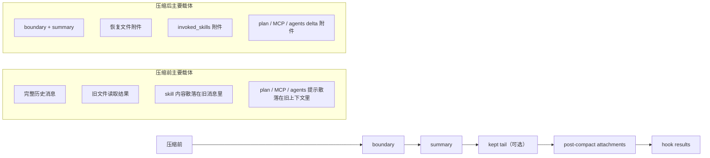

它想表达的只有一件事：compact 不是“删旧消息”，而是“把旧消息换成 boundary + summary + 必要附件”。也正因为如此，compact 后系统还能继续当前任务，而不是只剩一段泛泛总结。

#### 为什么 compact 之后还要补附件

因为 full compact 本质上会吃掉大量原始历史。单靠一段 summary，不足以恢复当前工作面。所以 post-compact attachments 实际在补三类东西：

- 当前工作对象  
  例如最近读过的重要文件、plan 文件、task 输出。
- 当前工作模式  
  例如 plan mode、deferred tools、agent listing、MCP instructions。
- 当前工作记忆  
  例如 invoked skills、部分 session memory。

这也是为什么 Claude Code 的 compact 读起来不像“简单总结”，更像“重建一个可继续工作的最小上下文”。

#### compact 之后 skill 保留的具体方式

这一点很重要。skill 并不是 compact 后就完全丢了。`createSkillAttachmentIfNeeded()` 会把当前 agent 已调用过的 skills 重新作为 `invoked_skills` attachment 带回去，见 [src/services/compact/compact.ts](/Users/bobo/code/claude-code-source-code/src/services/compact/compact.ts)。

它的策略是：

- 只保留当前 agent 作用域内调用过的 skills
- 按最近使用时间排序
- 每个 skill 单独截断到 token 上限
- 整体再受一个总 budget 限制

也就是说，compact 后 skill 不是“全量重放”，而是“保留最近真正用到的那部分指令内容”。

#### auto compact 和 reactive compact 的区别

两者容易混，但代码里是两条不同路径：

- `auto compact`  
  在达到阈值前后主动触发，目标是提前清掉旧上下文，避免撞到 API 极限。
- `reactive compact`  
  已经收到了 `prompt_too_long` 之类错误后，作为恢复路径触发。

在 `query.ts` 里，恢复顺序通常不是上来就 full compact，而是会先尝试更便宜的整理手段；只有这些不够时，才进入更重的 compact。

### 4.6 skills：是怎么加载进 context 的

skills 不是简单的 prompt 片段，而是一套“按来源加载、按时机激活、按调用注入”的机制。关键文件包括：

- [src/skills/loadSkillsDir.ts](/Users/bobo/code/claude-code-source-code/src/skills/loadSkillsDir.ts)
- [src/commands.ts](/Users/bobo/code/claude-code-source-code/src/commands.ts)
- [src/utils/processUserInput/processSlashCommand.tsx](/Users/bobo/code/claude-code-source-code/src/utils/processUserInput/processSlashCommand.tsx)
- [src/tools/FileReadTool/FileReadTool.ts](/Users/bobo/code/claude-code-source-code/src/tools/FileReadTool/FileReadTool.ts)

#### skills 在仓库里是什么

从实现上看，一个 skill 最终会被加载成一个 `prompt` 类型的命令对象，而不是单纯字符串。`createSkillCommand()` 会把它包装成结构化命令，包含：

- `name`
- `description`
- `whenToUse`
- `allowedTools`
- `model`
- `effort`
- `context`（inline / fork）
- `paths`
- `hooks`
- `getPromptForCommand()`

这说明 skill 在这套系统里更像“可调用能力单元”，不是普通文档。

#### skills 的来源

当前代码至少支持这些来源：

- 用户 `~/.claude/skills`
- 项目 `.claude/skills`
- managed/policy 下发的 skills 目录
- 额外 `--add-dir` 路径
- legacy `/commands` 目录中的 prompt commands
- bundled skills
- plugin skills
- MCP skills

入口主要在 [src/commands.ts](/Users/bobo/code/claude-code-source-code/src/commands.ts) 和 [src/skills/loadSkillsDir.ts](/Users/bobo/code/claude-code-source-code/src/skills/loadSkillsDir.ts)。

#### skills 什么时候会进入上下文

这块分三种情况：

##### 1. 启动时加载的静态 skills

启动阶段会先把常规可见 skills 读出来，加入 commands 列表。无条件 skills 会直接可见；带 `paths` frontmatter 的 conditional skills 先只注册、不激活。

##### 2. 文件操作触发的动态 skills

[src/tools/FileReadTool/FileReadTool.ts](/Users/bobo/code/claude-code-source-code/src/tools/FileReadTool/FileReadTool.ts) 在读文件时会：

- 根据当前文件路径向上发现嵌套的 `.claude/skills`
- 把这些目录中的 skills 动态加载进来
- 激活路径模式匹配到的 conditional skills

也就是说，模型不是一开始就看到所有 skills，而是在操作某些文件后，相关 skills 才逐步进入工作面。

##### 3. 真正调用 skill 时注入正文

skill 真正“进入 context”的关键时刻，不是被扫描到，而是被执行。

在 [src/utils/processUserInput/processSlashCommand.tsx](/Users/bobo/code/claude-code-source-code/src/utils/processUserInput/processSlashCommand.tsx) 里，调用 prompt skill 时会：

- 执行 `command.getPromptForCommand()`
- 把 skill markdown 展开成真实消息内容
- 附加 skill metadata
- 记录这次 skill invocation，供 compaction 和恢复使用
- 生成与 skill 相关的 attachments / permissions

所以更准确地说：

- 扫描到 skill：只是 capability 可见
- 真正调用 skill：才是 content 注入 context

#### conditional skills 是怎么激活的

带 `paths` frontmatter 的 skills 不会在启动时直接全量暴露。`loadSkillsDir.ts` 会先把它们放进 `conditionalSkills`，只有当文件路径匹配时，才移动到 `dynamicSkills` 中。

匹配逻辑是：

- 用 gitignore 风格规则匹配相对路径
- 只有当前工作目录内的路径才参与匹配
- 一旦命中，就把 skill 激活为动态 skill

这是一种很实用的 context 治理方式：让 skill 的可见性跟实际工作文件绑定。

### 4.7 `attachments.ts`：每一轮 context 是怎么被组装出来的

关键文件：

- [src/utils/attachments.ts](/Users/bobo/code/claude-code-source-code/src/utils/attachments.ts)
- [src/utils/messages.ts](/Users/bobo/code/claude-code-source-code/src/utils/messages.ts)
- [src/query.ts](/Users/bobo/code/claude-code-source-code/src/query.ts)

这一节回答一个在读 `query.ts` 时很容易被忽略的问题：每轮真正送给模型的 `context`，并不只是“messages + system prompt”，中间还会经过一层非常重的 attachment 组装。

如果只看名字，`attachments.ts` 很像一个“附件工具箱”；但从实现上看，它更像 runtime 的 context router。很多原本看起来属于不同子系统的东西，都会在这里按 turn 被重新注入：

- `relevant_memories`
- `dynamic_skill`
- `skill_listing`
- `plan_mode` / `plan_mode_reentry`
- `deferred_tools_delta`
- `agent_listing_delta`
- `mcp_instructions_delta`
- `teammate_mailbox`
- `team_context`
- `todo_reminders`
- `queued_commands`

也就是说，Claude Code 每一轮不是简单“沿用上轮上下文”，而是在重新拼一份当前最小可工作面。

#### `getAttachments()` 做的不是静态拼接

[src/utils/attachments.ts](/Users/bobo/code/claude-code-source-code/src/utils/attachments.ts) 里的 `getAttachments()` 有几个很关键的特点：

- 它会先处理跟当前 user input 直接相关的 attachment  
  例如 `@` 提到的文件、MCP resources、agent mentions、turn-0 的 skill discovery。
- 然后再补 thread 级 attachment  
  例如 `deferred_tools_delta`、`agent_listing_delta`、`nested_memory`、`dynamic_skill`、`plan_mode`、`todo_reminders`。
- 最后还会处理 swarm / teammate 相关输入  
  例如 mailbox、team context、task-notification。

这个顺序很重要，因为 attachment 之间是有依赖关系的。比如 user input 里提到的文件，会先影响 nested memory 的触发，再影响后面的 memory / skill 注入。

#### 可以把它理解成“第二调度层”

`query.ts` 负责 turn loop 的主状态推进，`attachments.ts` 则负责“这轮到底额外把什么塞进 context”。它之所以重要，是因为很多运行时行为并不是常驻消息，而是按 turn 临时注入的：

- 计划模式提醒不是常驻 prompt，而是按节奏重新附加
- deferred tools 的可见能力变化不会直接改旧消息，而是以 delta attachment 重新宣布
- teammate / task 状态也不是永久写死在主 transcript 里，而是通过 attachment 或 notification 在下一轮送进来

所以这层解决的不是“显示附件”，而是“运行时上下文装配”。

#### `plan_mode`、skill、mailbox 都是在这里重新进入 context

这也是读代码时最容易误判的一点。很多人会以为：

- plan mode 完全由 system prompt 控制
- skills 只在 slash command 时出现
- teammate message 会实时打断当前回合

但从 attachment 组装逻辑看，实际更接近：

- `plan_mode` 会按 turn count 节流，并在需要时以 `plan_mode_reentry` 之类 attachment 重新提醒
- 已发现的 dynamic skills 和 skill listing 会在 attachment 层持续进入当前工作面
- teammate mailbox 的消息会先进 inbox / pending queue，再在 turn 边界变成 `teammate_mailbox` attachment

因此，attachments 这一层本质上是在管理“当前轮模型应该临时看到什么”。

### 4.8 permissions / hooks / classifier：tool call 不是直接执行

关键文件：

- [src/services/tools/toolExecution.ts](/Users/bobo/code/claude-code-source-code/src/services/tools/toolExecution.ts)
- [src/services/tools/toolHooks.ts](/Users/bobo/code/claude-code-source-code/src/services/tools/toolHooks.ts)
- [src/utils/permissions/](/Users/bobo/code/claude-code-source-code/src/utils/permissions/)
- [src/hooks/useCanUseTool.tsx](/Users/bobo/code/claude-code-source-code/src/hooks/useCanUseTool.tsx)

这一节回答的是：模型发出一个 `tool_use` 之后，到底是怎样被系统接住的。

最重要的结论是：Claude Code 里的 tool call 不是 `findToolByName -> tool.call(input)` 这么短。真正的执行路径是一条完整的 policy pipeline。

#### 一次 tool call 的实际流水线

先看这张图。它表达的是一次典型 tool execution 的主要阶段：

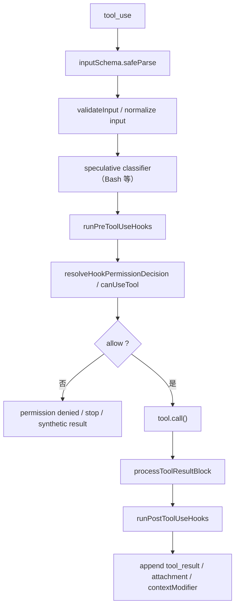

阅读重点是：

- 前半段在做“能不能执行”
- 中间在做“真正执行”
- 后半段在做“结果如何落回消息和上下文”

这也是为什么 Claude Code 的 autonomy boundary 不在 UI，而在 tool pipeline 本身。

#### 执行前：schema、hooks、permission 是同一条链

从 [src/services/tools/toolExecution.ts](/Users/bobo/code/claude-code-source-code/src/services/tools/toolExecution.ts) 看，前置阶段至少包括：

1. `inputSchema.safeParse`  
   先把模型给的输入校验成工具可接受的结构。
2. `validateInput` / 补齐 observable input  
   某些工具会在这里做更细的输入修正或可观测字段回填。
3. speculative classifier  
   对 Bash 这类高风险工具，会提前启动 classifier 或 permission 预测。
4. `runPreToolUseHooks`  
   hook 可以加消息、改输入、直接返回 stop、甚至改变后续权限判断。
5. `resolveHookPermissionDecision`  
   把 hook 给出的 permission result、工具自己的 `checkPermissions()`、全局 `canUseTool` 统一收敛成一个最终决策。

也就是说，permissions、hooks、classifier 在这里不是平行附属模块，而是同一条执行链上的连续阶段。

#### 执行中：`tool.call()` 只是中段

只有前面的决策链通过之后，系统才会真正调用 `tool.call()`。

这说明一个很重要的设计取向：

- 工具实现只负责“怎么做”
- 是否允许做、是否需要重写输入、是否该提前停下，都在外层 pipeline 里决定

这也是为什么工具作者虽然可以自定义 `checkPermissions()`，但最终行为仍然要经过统一的 runtime 决策链。

#### 执行后：结果不是直接塞回消息

后半段也不是简单 `result -> tool_result`。执行完成后还会经过：

- `processToolResultBlock()` 或预映射 block 处理
- 结果大小控制与 content replacement
- `runPostToolUseHooks()`
- 可能追加 `structured_output` attachment
- 可能追加 `contextModifier`

这意味着 tool output 进入会话之前，仍然要先经过一次 runtime 整形。

#### 为什么这一层很关键

这条 pipeline 决定了 Claude Code 的一个核心特征：模型“想做什么”和“系统允许它怎么做”之间，不是软约束，而是一条显式执行链。

也正因为如此，读工具系统时最好不要只读 [src/Tool.ts](/Users/bobo/code/claude-code-source-code/src/Tool.ts) 和具体工具实现；真正决定行为边界的，是 [src/services/tools/toolExecution.ts](/Users/bobo/code/claude-code-source-code/src/services/tools/toolExecution.ts)。

### 4.9 tasks / subagents / mailbox：异步执行底座

关键文件：

- [src/Task.ts](/Users/bobo/code/claude-code-source-code/src/Task.ts)
- [src/utils/task/framework.ts](/Users/bobo/code/claude-code-source-code/src/utils/task/framework.ts)
- [src/tools/AgentTool/runAgent.ts](/Users/bobo/code/claude-code-source-code/src/tools/AgentTool/runAgent.ts)
- [src/tasks/LocalAgentTask/LocalAgentTask.tsx](/Users/bobo/code/claude-code-source-code/src/tasks/LocalAgentTask/LocalAgentTask.tsx)
- [src/utils/teammateMailbox.ts](/Users/bobo/code/claude-code-source-code/src/utils/teammateMailbox.ts)
- [src/coordinator/coordinatorMode.ts](/Users/bobo/code/claude-code-source-code/src/coordinator/coordinatorMode.ts)
- [src/utils/swarm/inProcessRunner.ts](/Users/bobo/code/claude-code-source-code/src/utils/swarm/inProcessRunner.ts)

这一节回答的是：Claude Code 里的 agent / teammate / remote task，为什么已经不像“工具里顺手起个异步线程”，而更像一层独立 runtime substrate。

#### task 先被建模成一等执行体

从 [src/Task.ts](/Users/bobo/code/claude-code-source-code/src/Task.ts) 看，系统先定义了统一的 task 类型和生命周期：

- `local_bash`
- `local_agent`
- `remote_agent`
- `in_process_teammate`
- `local_workflow`
- `monitor_mcp`
- `dream`

每个 task 至少都有：

- `id`
- `type`
- `status`
- `description`
- `outputFile`
- `outputOffset`
- `notified`

这说明 task 在这里不是“UI 面板上的一条记录”，而是有 identity、有 output、有 lifecycle 的一等运行时对象。

#### `task/framework.ts` 管的是执行底座，不只是展示

[src/utils/task/framework.ts](/Users/bobo/code/claude-code-source-code/src/utils/task/framework.ts) 里最重要的不是轮询，而是这些统一职责：

- `registerTask()`：把新执行体注册进 AppState
- `generateTaskAttachments()`：检查是否有新输出或状态更新
- `applyTaskOffsetsAndEvictions()`：合并 output offset 和 GC
- `pollTasks()`：统一轮询 task 更新

特别是 `registerTask()`，它在 resume / replacement 时会保留已有的 UI held state、messages、pending messages、diskLoaded 状态。这说明 task runtime 已经在关心“如何不中断地继续一个执行体”，而不是只关心“如何显示一条状态”。

#### subagent 也不是普通函数调用

[src/tools/AgentTool/runAgent.ts](/Users/bobo/code/claude-code-source-code/src/tools/AgentTool/runAgent.ts) 里可以看到几个很重要的事实：

- subagent 会拿到独立的 `agentId`
- 会克隆或继承自己的 `ToolUseContext`
- 会写 sidechain transcript，而不是只活在父会话内存里
- 会写 agent metadata，供后续 resume / routing 使用
- 某些子代理还会保留 `toolUseResult`，确保 transcript 可查看、可恢复

也就是说，subagent 在这里已经是有独立状态、独立 transcript、独立恢复路径的执行体。

#### mailbox 是显式通信协议

再看 [src/utils/teammateMailbox.ts](/Users/bobo/code/claude-code-source-code/src/utils/teammateMailbox.ts)，这里实现的是一个文件式 mailbox：

- 每个 teammate 有自己的 inbox 文件
- 其他 teammate 往这个 inbox 写消息
- 收件人下一轮把 unread messages 读出来
- 再把它们包装成 `teammate_mailbox` attachment 送进模型

这说明 teammate 之间并不是共享同一份 transcript，而是通过显式消息投递来协作。

#### 消息投递是按 turn 边界发生的

这一点很关键。[src/tasks/LocalAgentTask/LocalAgentTask.tsx](/Users/bobo/code/claude-code-source-code/src/tasks/LocalAgentTask/LocalAgentTask.tsx) 里明确有：

- `queuePendingMessage()`
- `drainPendingMessages()`

注释也写得很清楚：mid-turn 的 `SendMessage` 不会直接打断当前 agent，而是先进入 `pendingMessages`，等到 tool-round boundary 再 drain。

这意味着 Claude Code 的 teammate 协作语义更像 actor mailbox：

- 可以异步发消息
- 但不会在当前 turn 内任意插入，破坏本轮状态机
- 真正生效是在下一轮输入边界

#### coordinator 模式改的不是 prompt，而是消息协议

[src/coordinator/coordinatorMode.ts](/Users/bobo/code/claude-code-source-code/src/coordinator/coordinatorMode.ts) 里最有意思的一点是：worker 的完成结果会以 `<task-notification>` XML 形式，作为 user-role message 注入 coordinator。

所以 coordinator mode 真正改变的不是“更会 delegation 的 system prompt”，而是：

- worker results 以结构化 task-notification 进入主会话
- coordinator 要把这些通知当作内部事件，而不是普通用户说话
- `SendMessage` / `TaskStop` 成了显式 continuation protocol

#### 看这张图会更直观

下面这张图把 coordinator、subagent、mailbox 和 turn boundary 的关系放在一起看：

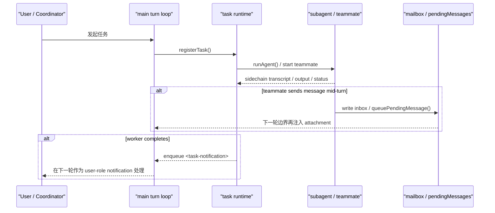

这张图的重点只有两件事：

- task runtime 是执行体和主会话之间的桥
- mailbox / notification 的投递不是“即时打断”，而是“在下一轮边界进入 turn loop”

这也解释了为什么 Claude Code 的多 agent 协作看起来比较稳：它牺牲了一点即时性，换来了 turn 内状态的一致性。

### 4.10 关键状态载体：运行时真正靠什么维持连续性

读到这里，最好把 Claude Code 里的“状态”再单独抽出来看一遍。因为这套 runtime 真正难的地方，不是模块数多，而是状态分散在几种不同载体里。

最重要的几类是：

- `messages`
- transcript / sidechain transcript
- `ToolUseContext`
- `AppState`
- attachments / sidecar artifacts

如果只盯其中一种，很容易误判系统边界。

#### `messages`：turn loop 的直接工作面

`messages` 是 `query.ts` 最直接操作的对象。它承载：

- 当前 assistant / user 历史
- `tool_use` / `tool_result`
- compact boundary
- 一部分 attachment message

但它不是“唯一真相”。因为 compact、recovery、subagent、mailbox、task notification 都可能从别的载体重新影响下一轮消息。

更准确地说：

- `messages` 决定当前 turn 怎么跑
- 但并不独占系统连续性

#### transcript / sidechain transcript：durable history

前面讲 recovery 时已经提过，transcript 保存的是一条可恢复消息链。这里再往前一步看：

- 主会话有主 transcript
- subagent / teammate 还有 sidechain transcript
- task output 也会单独落盘

所以 Claude Code 的连续性不是只靠一份 `messages[]` 留在内存里，而是靠“内存工作面 + durable sidecar”共同维持。

这也是为什么很多 resume 行为看起来不像“恢复 UI”，而更像“重建运行时”。

#### `ToolUseContext`：工具执行总线

[src/Tool.ts](/Users/bobo/code/claude-code-source-code/src/Tool.ts) 里的 `ToolUseContext` 是另一个关键载体。它暴露的不只是工具参数，而是一整条 runtime 总线：

- `commands`
- `tools`
- `mcpClients`
- `agentDefinitions`
- `readFileState`
- `messages`
- `getAppState()` / `setAppState()`
- notification、UI、compact、response length 等各种回调

所以它本质上不是“工具上下文”，而是“工具能接触到的运行时表面”。

这也是为什么文档前面一直强调：很多行为边界不在单个工具里，而在 `ToolUseContext + toolExecution pipeline` 这层。

#### `AppState`：宿主共享状态总线

[src/state/AppStateStore.ts](/Users/bobo/code/claude-code-source-code/src/state/AppStateStore.ts) 里的 `AppState` 更像宿主总线，而不是会话消息本身。它包含很多跨 turn、跨组件、跨执行体的共享状态：

- `toolPermissionContext`
- `tasks`
- `mcp`
- `plugins`
- `agentDefinitions`
- `fileHistory`
- `attribution`
- `todos`
- notification / elicitation queue
- 远程会话、bridge、tmux、browser 等 UI 与会话状态

这说明：

- `messages` 负责 turn
- `AppState` 负责宿主

两者并不是同一层问题。

#### attachments / sidecar artifacts：临时工作面

还有一类状态不适合放在 `messages` 或 `AppState` 里，于是系统把它们做成 attachment 或 sidecar artifact：

- `relevant_memories`
- `invoked_skills`
- `plan_mode`
- `teammate_mailbox`
- task output file
- content replacement records
- session memory / MEMORY.md / daily logs

这类状态的特点是：

- 不一定永远常驻
- 但会在某些 turn 被重新注入
- 对当前工作面非常关键

所以 Claude Code 的连续性模型，最好理解成三层：

- turn-local：`messages`
- host-wide：`AppState`
- durable / on-demand：transcript + attachments + sidecar artifacts

### 4.11 调试入口：读源码和排障时先看哪里

到这里其实已经能总结出一套很实用的排障入口了。下面这张表不是理论分类，而是“遇到问题时先开哪个文件”的捷径。

#### 如果问题出在 turn loop

先看：

- [src/query.ts](/Users/bobo/code/claude-code-source-code/src/query.ts)
- [src/QueryEngine.ts](/Users/bobo/code/claude-code-source-code/src/QueryEngine.ts)

典型问题：

- 为什么这轮又继续了一次
- 为什么没有停
- 为什么进入 compact / continuation / retry
- 为什么 `tool_use` / `tool_result` 看起来不对

#### 如果问题出在 context 太大或 cache 漂移

先看：

- [src/services/compact/compact.ts](/Users/bobo/code/claude-code-source-code/src/services/compact/compact.ts)
- [src/services/compact/microCompact.ts](/Users/bobo/code/claude-code-source-code/src/services/compact/microCompact.ts)
- [src/utils/analyzeContext.ts](/Users/bobo/code/claude-code-source-code/src/utils/analyzeContext.ts)
- [src/services/api/promptCacheBreakDetection.ts](/Users/bobo/code/claude-code-source-code/src/services/api/promptCacheBreakDetection.ts)

典型问题：

- 为什么突然 `prompt_too_long`
- 为什么这轮 cache miss
- 是 system prompt 变了、tool schema 变了，还是 skill / MCP 漂了
- 到底是谁吃掉了上下文

#### 如果问题出在“为什么工具没跑 / 被拒绝”

先看：

- [src/services/tools/toolExecution.ts](/Users/bobo/code/claude-code-source-code/src/services/tools/toolExecution.ts)
- [src/services/tools/toolHooks.ts](/Users/bobo/code/claude-code-source-code/src/services/tools/toolHooks.ts)
- [src/utils/permissions/](/Users/bobo/code/claude-code-source-code/src/utils/permissions/)
- [src/hooks/useCanUseTool.tsx](/Users/bobo/code/claude-code-source-code/src/hooks/useCanUseTool.tsx)

典型问题：

- schema 为什么没过
- hook 改了什么
- permission 为什么 deny / ask
- classifier 为什么把它拦下来了

#### 如果问题出在“为什么会话能恢复 / 恢复后又怪怪的”

先看：

- [src/utils/sessionStorage.ts](/Users/bobo/code/claude-code-source-code/src/utils/sessionStorage.ts)
- [src/utils/conversationRecovery.ts](/Users/bobo/code/claude-code-source-code/src/utils/conversationRecovery.ts)

典型问题：

- 为什么 resume 后多了一条 synthetic continue
- 为什么某些旧消息不见了
- compact boundary 是怎么生效的
- 为什么 orphaned `tool_result` 被补或被过滤

#### 如果问题出在多 agent / task / mailbox

先看：

- [src/utils/task/framework.ts](/Users/bobo/code/claude-code-source-code/src/utils/task/framework.ts)
- [src/tools/AgentTool/runAgent.ts](/Users/bobo/code/claude-code-source-code/src/tools/AgentTool/runAgent.ts)
- [src/tasks/LocalAgentTask/LocalAgentTask.tsx](/Users/bobo/code/claude-code-source-code/src/tasks/LocalAgentTask/LocalAgentTask.tsx)
- [src/utils/teammateMailbox.ts](/Users/bobo/code/claude-code-source-code/src/utils/teammateMailbox.ts)

典型问题：

- 为什么 worker 没回消息
- 为什么消息要下一轮才到
- sidechain transcript 为什么缺东西
- task 为何被 GC / retain / replacement

#### 如果问题出在性能或“为什么这一轮特别慢”

先看：

- [src/utils/queryProfiler.ts](/Users/bobo/code/claude-code-source-code/src/utils/queryProfiler.ts)
- [src/utils/analyzeContext.ts](/Users/bobo/code/claude-code-source-code/src/utils/analyzeContext.ts)
- [src/services/api/promptCacheBreakDetection.ts](/Users/bobo/code/claude-code-source-code/src/services/api/promptCacheBreakDetection.ts)

这三者分别回答：

- 慢在哪个阶段
- 上下文是谁吃掉的
- cache 为什么断了

如果把这三块配合起来看，基本能解释绝大多数“为什么这一轮突然变贵 / 变慢 / 变长”的问题。

### 4.12 工具系统

#### 工具协议

文件： [src/Tool.ts](/Users/bobo/code/claude-code-source-code/src/Tool.ts)

`ToolUseContext` 很大，说明工具不是简单输入输出函数，而是可以访问：

- 当前 app state
- 权限上下文
- MCP 客户端
- 消息列表
- 文件读取状态
- 通知与 UI
- attribution / file history
- nested memory / discovered skills

这是一套强耦合但功能完整的工具协议。

#### 工具注册

文件： [src/tools.ts](/Users/bobo/code/claude-code-source-code/src/tools.ts)

这里注册了大量工具，包括：

- Bash
- FileRead / FileEdit / FileWrite
- NotebookEdit
- WebFetch / WebSearch
- AskUserQuestion
- SkillTool
- MCP 相关工具
- Task 系列工具
- LSPTool
- Worktree / PlanMode 工具
- Agent / Team / SendMessage 等高级工具

工具集合会根据 `feature()`、`process.env`、settings 和当前运行模式做裁剪。

### 4.13 工具执行与并发模型

关键文件：

- [src/services/tools/toolOrchestration.ts](/Users/bobo/code/claude-code-source-code/src/services/tools/toolOrchestration.ts)
- [src/services/tools/StreamingToolExecutor.ts](/Users/bobo/code/claude-code-source-code/src/services/tools/StreamingToolExecutor.ts)

`toolOrchestration.ts` 会把工具调用拆成：

- 并发安全工具
- 非并发安全工具

连续的只读工具可以并发跑，非只读或不安全工具串行跑。这是一个非常务实的性能优化点。

`StreamingToolExecutor` 则处理“模型边输出边产生 tool_use”的场景，提供：

- tool queue
- 并发安全判断
- sibling error 取消
- 用户中断取消
- streaming fallback 丢弃机制
- 结果按接收顺序输出

### 4.14 BashTool：最复杂的本地执行工具

核心文件： [src/tools/BashTool/BashTool.tsx](/Users/bobo/code/claude-code-source-code/src/tools/BashTool/BashTool.tsx)

相关文件：

- [bashPermissions.ts](/Users/bobo/code/claude-code-source-code/src/tools/BashTool/bashPermissions.ts)
- [bashSecurity.ts](/Users/bobo/code/claude-code-source-code/src/tools/BashTool/bashSecurity.ts)
- [readOnlyValidation.ts](/Users/bobo/code/claude-code-source-code/src/tools/BashTool/readOnlyValidation.ts)
- [pathValidation.ts](/Users/bobo/code/claude-code-source-code/src/tools/BashTool/pathValidation.ts)
- [sedValidation.ts](/Users/bobo/code/claude-code-source-code/src/tools/BashTool/sedValidation.ts)
- [shouldUseSandbox.ts](/Users/bobo/code/claude-code-source-code/src/tools/BashTool/shouldUseSandbox.ts)

它不只是执行 shell 命令，还负责：

- schema 与参数校验
- 命令语义识别
- 只读 / 搜索 / 列表命令识别
- sandbox 选择
- 权限检查
- 路径约束
- sed 编辑预览与保护
- 后台任务控制
- 文件修改历史
- 输出截断与落盘
- UI 渲染

这个仓库很清楚地把“真正的执行力核心”放在 shell/file 工具的约束设计上，而不是只放在模型本身。

## 5. 配置、认证与服务端控制

这一节回答的是：哪些能力由本地配置决定，哪些能力由服务端裁决，以及客户端具体怎样执行这些限制。

### 5.1 配置系统

核心文件： [src/utils/settings/settings.ts](/Users/bobo/code/claude-code-source-code/src/utils/settings/settings.ts)

这套系统不是单一文件配置，而是多来源叠加：

- 用户设置
- 项目设置
- 本地设置
- CLI flag 设置
- 企业 managed settings
- 远程 managed settings
- MDM / Windows 注册表策略

它支持：

- `managed-settings.json`
- `managed-settings.d/*.json`

并按“基础文件 + drop-in 覆盖”的方式合并。整体特点是：

- 读取结果有缓存
- 使用 `zod` 做 schema 校验
- 合并逻辑不是简单 `Object.assign`
- 尽量“带错误继续”

### 5.2 认证系统

核心文件：

- [src/cli/handlers/auth.ts](/Users/bobo/code/claude-code-source-code/src/cli/handlers/auth.ts)
- [src/services/oauth/index.ts](/Users/bobo/code/claude-code-source-code/src/services/oauth/index.ts)
- [src/services/oauth/client.ts](/Users/bobo/code/claude-code-source-code/src/services/oauth/client.ts)
- [src/utils/auth.ts](/Users/bobo/code/claude-code-source-code/src/utils/auth.ts)
- [src/constants/oauth.ts](/Users/bobo/code/claude-code-source-code/src/constants/oauth.ts)

从代码看，至少支持这些认证路径：

- Claude.ai OAuth
- Console OAuth
- `ANTHROPIC_API_KEY`
- `ANTHROPIC_AUTH_TOKEN`
- `CLAUDE_CODE_OAUTH_TOKEN`
- file descriptor 传入的 token / key
- `apiKeyHelper`
- Bedrock / Vertex / Foundry 的第三方凭据

OAuth 由 `OAuthService` 封装，采用 Authorization Code + PKCE：

1. 本地起 callback 监听
2. 生成 `code_verifier`、`code_challenge`、`state`
3. 构造授权 URL
4. 打开浏览器
5. 获取授权码
6. 调 token endpoint 换 token
7. 获取 profile
8. 保存账户与组织信息

存储层面：

- Claude.ai OAuth token 存 secure storage
- API key 在 macOS 上优先存 Keychain，失败时回退到配置

运行时还处理：

- token 缓存失效
- 多进程之间的 token 变更探测
- 401 后强制刷新
- 刷新时 lockfile 去重

### 5.3 请求层如何识别当前用户

OAuth 登录成功后，客户端不仅保存 token，还会拉取 profile，把这些信息写入本地状态：

- account UUID
- email
- organization UUID
- display name
- subscription type
- billing type
- organization role / workspace role

请求构造时，平台识别当前请求也不只靠 token。在 [src/services/api/client.ts](/Users/bobo/code/claude-code-source-code/src/services/api/client.ts) 和 [src/services/api/claude.ts](/Users/bobo/code/claude-code-source-code/src/services/api/claude.ts) 中，还会带上：

- `X-Claude-Code-Session-Id`
- `User-Agent`
- `x-app`
- 远程容器 / remote session 相关 header
- `device_id`
- `account_uuid`
- `session_id`

因此，从客户端代码看，识别维度至少包含三层：

- 凭证：token / API key 本身
- 账户：account / organization / subscription
- 会话与设备：device_id / session_id / client headers

补充一点：这里的 `device_id` 不是网卡 MAC 地址，而是本地生成并持久化的随机标识。代码里没有看到直接读取 MAC 地址的实现。

### 5.4 限制与“封禁”如何落地

这里的“封禁”更多不是客户端维护本地黑名单，而是服务端决定是否允许，客户端负责执行结果。主要有四种落地方式：

#### 认证级拒绝

如果服务端直接让 token 或 key 失效，客户端会进入认证失败路径。代码里明确处理了：

- `OAuth token has been revoked`
- `OAuth authentication is currently not allowed for this organization`
- `Organization has been disabled`
- `invalid x-api-key`

相关实现见 [src/services/api/errors.ts](/Users/bobo/code/claude-code-source-code/src/services/api/errors.ts) 和 [src/utils/auth.ts](/Users/bobo/code/claude-code-source-code/src/utils/auth.ts)。

#### 组织策略限制

服务端通过 `/api/claude_code/policy_limits` 返回 policy 限制，客户端本地执行。

核心文件：

- [src/services/policyLimits/index.ts](/Users/bobo/code/claude-code-source-code/src/services/policyLimits/index.ts)
- [src/services/policyLimits/types.ts](/Users/bobo/code/claude-code-source-code/src/services/policyLimits/types.ts)

返回格式的特点是：

- 只返回被限制的策略项
- 未出现的策略默认视为允许

客户端通过 `isPolicyAllowed(policy)` 统一判断功能是否可用。

#### 远程托管设置

服务端通过 `/api/claude_code/settings` 下发远程托管设置。

核心文件：

- [src/services/remoteManagedSettings/index.ts](/Users/bobo/code/claude-code-source-code/src/services/remoteManagedSettings/index.ts)
- [src/services/remoteManagedSettings/securityCheck.tsx](/Users/bobo/code/claude-code-source-code/src/services/remoteManagedSettings/securityCheck.tsx)

它可以控制：

- hooks
- 权限规则
- MCP allowlist
- 插件行为
- 登录组织要求
- 其他 managed settings 项

#### 强制组织绑定

最接近“指定身份才能使用”的逻辑是 `forceLoginOrgUUID`。客户端会在登录后校验当前 token 所属组织；不匹配就视为无效登录。

实现见 [src/utils/auth.ts](/Users/bobo/code/claude-code-source-code/src/utils/auth.ts) 中的 `validateForceLoginOrg()`。

### 5.5 客户端和服务端各管什么

职责边界很清楚：

- 服务端负责裁决：token 是否有效、组织是否允许 OAuth、组织是否 disabled、策略是否关闭、托管设置是否下发
- 客户端负责执行：刷新 token、本地缓存与失效、根据 policy 禁用功能、根据 managed settings 改行为、在必要时退出或显示阻断 UI

因此，更准确的说法不是“客户端封用户”，而是“服务端决定，客户端落实”。

### 5.6 关于 IP 风险，代码能确认什么

基于当前客户端代码，可以明确确认的是：

- 平台会识别账号、组织、会话、设备级标识
- 客户端会把 `device_id`、`session_id`、`account_uuid` 等元数据带到请求或遥测中
- 服务端会返回与账号/组织状态直接相关的限制结果

但基于当前代码，不能直接确认的是：

- 服务端是否按 IP 做风控
- 是否按地域、ASN、代理出口、网络环境做限制
- 是否把 IP 与账号、设备 ID、组织信息做联合判定

更稳妥的工程判断是：账号、组织、认证来源一致性在客户端代码里更容易被直接看到；IP 是否构成主要风险因子属于服务端风控问题，不能靠当前仓库下定论。

### 5.7 认证调用链时序

这张图只看主路径即可：浏览器 OAuth 登录成功后，客户端不仅拿 token，还会立刻拉 profile，并刷新本地与策略相关的运行时状态。

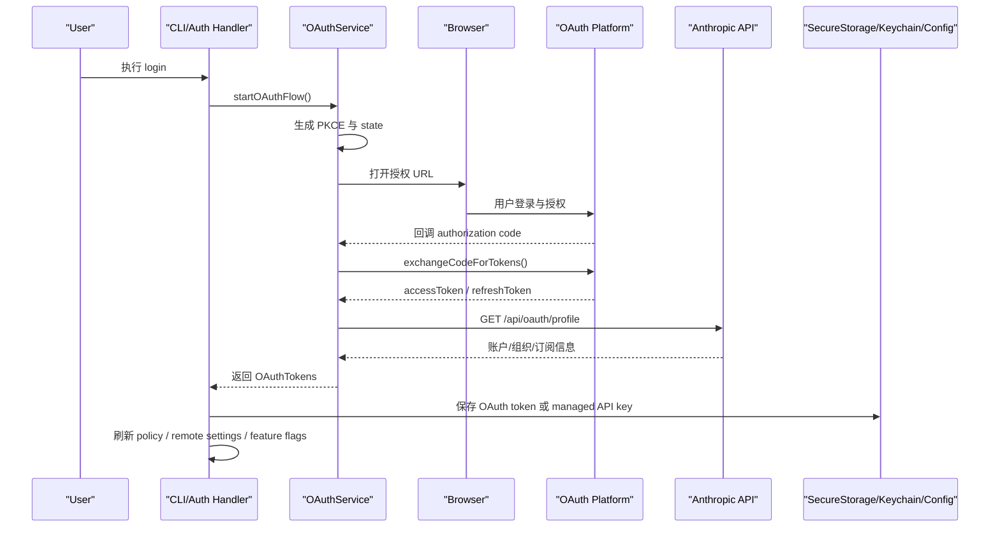

它对应的不是“单纯登录成功”，而是“登录完成后的一整轮状态重建”。这也是为什么认证、配置、策略三块在代码里会耦合得比较紧。

### 5.8 token 刷新与 401 恢复

这张图讲的是运行中的 token lifecycle，不是初次登录。阅读时重点看两个分支：

- 请求前发现 token 过期，走正常 refresh
- 请求后收到 401，再走一次恢复路径

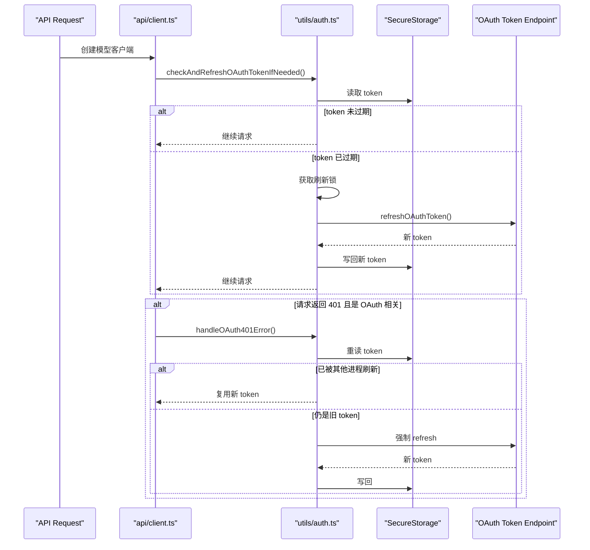

对应到代码上，这解释了为什么 [src/utils/auth.ts](/Users/bobo/code/claude-code-source-code/src/utils/auth.ts) 看起来会比普通 OAuth helper 重很多。它实际上承担了多进程环境下的 token runtime 管理。

### 5.9 认证、策略和配置为什么难拆

一个很关键的实现点是：认证、策略和配置不是独立模块，它们会彼此影响。例如：

- 登录后要刷新 remote managed settings
- 登录后要刷新 policy limits
- GrowthBook 依赖最新 auth 状态
- 某些组织才有资格拉 policy / remote settings
- `forceLoginOrgUUID` 会把机器绑定到指定组织

这让系统更强，但也明显提高了理解与测试成本。

## 6. API、Prompt 与扩展系统

这一节回答的是：模型请求是怎么发出去的，prompt stack 怎样参与运行时控制，以及 MCP / 插件 / 命令这些扩展面如何接进系统。

### 6.1 API 客户端层

核心文件是 [src/services/api/client.ts](/Users/bobo/code/claude-code-source-code/src/services/api/client.ts) 和 [src/services/api/claude.ts](/Users/bobo/code/claude-code-source-code/src/services/api/claude.ts)。

`client.ts` 的职责更像统一客户端构造器：

- 组装默认 headers
- 加 session / container / client app 标识
- 检查并刷新 OAuth token
- 必要时改用 API key
- 根据环境切换 Anthropic 1P、Bedrock、Foundry、Vertex

`claude.ts` 更接近模型协议层：

- 把内部消息转成 API message params
- 组装工具 schema
- 处理 streaming / non-streaming
- 处理 prompt cache、beta headers、task budget、thinking
- 记录 API usage、cost、duration

### 6.2 prompt stack 不只是文案，而是一层 control plane

如果只把 prompt 看成“系统提示词文本”，会低估这套系统。当前代码里，prompt 更像一层 runtime control plane。

关键点包括：

- prompt 有明确的优先级和组装逻辑，不同宿主模式会切换整套规则
- system prompt 不是单一长字符串，而是带动态边界的结构化 section
- 有些内容为了 prompt cache 稳定性必须放在静态前缀，有些内容则只能动态注入
- 顶层 system prompt 之外，还有 reminder、attachments、tool prompt、classifier prompt 等次级指令通道

相关实现主要见：

- [src/utils/systemPrompt.ts](/Users/bobo/code/claude-code-source-code/src/utils/systemPrompt.ts)
- [src/constants/prompts.ts](/Users/bobo/code/claude-code-source-code/src/constants/prompts.ts)
- [src/utils/messages.ts](/Users/bobo/code/claude-code-source-code/src/utils/messages.ts)

从架构角度看，prompt 在这里承担了两件事：

- 定义宿主行为法则
- 参与 prompt cache 的稳定前缀管理

### 6.3 命令系统

文件： [src/commands.ts](/Users/bobo/code/claude-code-source-code/src/commands.ts)

这个文件集中注册所有命令，覆盖：

- 登录与认证
- 会话恢复与状态
- memory / compact / context
- review / diff / usage / stats
- plugin / skills / mcp
- remote / teleport / bridge
- 主题、键位、输出格式

命令不只来自源码内建，也会来自 skills、plugins 和 feature-gated 内部命令，所以命令系统本质上也是一层扩展平台。

### 6.4 MCP 系统

文件： [src/services/mcp/client.ts](/Users/bobo/code/claude-code-source-code/src/services/mcp/client.ts)

它支持：

- stdio transport
- SSE transport
- streamable HTTP transport
- WebSocket transport
- OAuth 相关认证
- tool / resource / prompt 枚举
- 401 恢复
- 内容截断
- 二进制持久化

MCP 在这套系统里不是附属物，而是一级扩展面：MCP server 可以暴露 tools、resources、prompts，并直接参与主工具集合构造。

### 6.5 插件系统

文件： [src/utils/plugins/pluginLoader.ts](/Users/bobo/code/claude-code-source-code/src/utils/plugins/pluginLoader.ts)

插件目录里可以包含：

- `plugin.json`
- `commands/`
- `agents/`
- `hooks/`

插件来源包括：

- marketplace
- session plugins
- CLI 传入目录
- builtin plugins

同时它会校验 manifest、依赖、marketplace 策略、blocklist / allowlist 和 managed settings 锁定。也就是说，插件系统和企业策略是深度耦合的。

### 6.6 可观测性：这套 runtime 会解释自己为什么变慢

这是当前文档之前写得不够的一块，但源码里其实很重要：这套系统不只是“能跑”，还在尝试解释自己为什么这样跑。

相关文件至少包括：

- [src/utils/queryProfiler.ts](/Users/bobo/code/claude-code-source-code/src/utils/queryProfiler.ts)
- [src/services/api/promptCacheBreakDetection.ts](/Users/bobo/code/claude-code-source-code/src/services/api/promptCacheBreakDetection.ts)
- [src/utils/analyzeContext.ts](/Users/bobo/code/claude-code-source-code/src/utils/analyzeContext.ts)

从这些代码能看出三件事：

- query pipeline 被拆成可诊断阶段  
  不是只知道“这一轮慢了”，而是尽量区分 context loading、microcompact、tool schema build、API 往返、tool execution 等阶段。
- prompt cache 失效会被解释  
  例如 system prompt、tools、fast mode、cache 策略变化导致的 prefix 漂移，不只是发生了，还尽量告诉开发者为什么发生。
- 上下文占用是可分析的  
  系统会分别统计 system prompt、memory、tools、agent definitions、commands、messages 等部分是谁在吃上下文预算。

这层能力对生产 agent 很关键，因为没有可观测性，就很难持续优化 harness。

## 7. 公开源码边界与代码质量

这一节主要帮助读者建立阅读边界：哪些结论能直接从代码证实，哪些只能保留为设计意图或公开构建不可达分支。

### 7.1 Feature Flags 与编译裁剪

整个仓库大量使用 `feature('...')` 与 `bun:bundle`。这意味着：

- 某些模块是公开包中被编译期裁掉的
- 源码里能看到分支，但实际 npm 发布版未必包含实现
- 阅读时要区分“逻辑存在”与“公开构建可达”

这也是为什么 README 会强调这份源码并不完整。

### 7.2 代码质量评价

优点：

- 工程成熟度高，很多细节都是线上问题驱动
- 抽象边界总体清楚：auth、settings、tools、mcp、query 分层明确
- 对 shell 与权限安全很重视
- 对多进程、缓存、401、锁、长输出等问题处理扎实
- 明显不是演示性质项目，而是长期演化的产品代码

主要问题：

- 超大文件过多：`main.tsx`、`query.ts`、`print.ts`、`messages.ts` 等
- feature flag 与内部/外部分支太多，阅读成本很高
- cross-cutting concern 太重：认证、遥测、策略、hooks 穿透多个层次
- `utils/` 目录承载过多核心逻辑，容易形成“万能目录”
- 公开源码不完整，导致部分路径只能看设计意图，不能完全验证

从更高层看，当前代码的主要结构债不只是“大文件多”，而是若干关键约束没有单独 owner：

- `query.ts` 已经接近 God Loop
- 一部分上下文注入逻辑分散在 attachments / messages / prompt 相关模块中
- `ToolUseContext` 过胖，容易变成高耦合总线
- cache invariants 分散在多个文件里维护
- continuity surface 很多，但缺少统一 taxonomy
- permissions / tasks / remote execution 已经上升成 control plane，却还分散在多个实现层

这类问题不会立刻让系统失效，但会显著抬高后续演化和重构成本。

## 8. 产出：基于源码提炼的 Claude Code 使用技巧

这一节不再分析模块，而是把前面走读中能稳定复用的方法提炼成实际使用建议。

这一节不是复述功能，而是把前面走读中能稳定复用的“使用方法论”整理成可直接落地的产出。

相关代码主要见：

- [src/constants/prompts.ts](/Users/bobo/code/claude-code-source-code/src/constants/prompts.ts)
- [src/utils/messages.ts](/Users/bobo/code/claude-code-source-code/src/utils/messages.ts)
- [src/tools/BashTool/prompt.ts](/Users/bobo/code/claude-code-source-code/src/tools/BashTool/prompt.ts)

### 8.1 高质量任务描述模板

从这套系统 prompt 的风格看，一个高质量任务描述应尽量包含四部分：

- 目标：你要它完成什么
- 范围：允许改哪些文件或模块
- 约束：不要做什么
- 验证：如何证明完成

推荐模板：

```text
目标：修复/实现……
范围：只改 …… 相关代码，优先复用现有实现，不要扩散修改
约束：不要做无关重构；不要新增不必要文件；不要提交 commit
验证：运行 …… 测试/命令，并说明结果
如果发现我的判断有误，直接指出
```

### 8.2 最值得长期使用的几条提示

明确限制范围：

```text
只修这个问题，不做顺手重构，不改无关逻辑。
```

明确要求先读代码：

```text
先看 src/foo.ts 和 src/bar.ts，再决定改法。
```

明确优先复用：

```text
优先复用现有函数、工具或模式，不要新造一套抽象。
```

明确不要新建文件：

```text
除非绝对必要，不要新建文件。
```

明确验证要求：

```text
改完后跑相关测试，并如实说明通过/失败情况。
```

### 8.3 面向不同任务类型的推荐 prompt

Bug 修复：

```text
定位并修复这个问题：……
要求最小改动，优先复用现有逻辑，不要重构无关代码。
修完后运行相关测试并说明结果。
```

新功能实现：

```text
实现这个功能：……
先看现有相关模块，尽量沿用已有模式。
只改必要文件，不要额外加抽象层。
最后告诉我改动点和验证方式。
```

代码分析：

```text
先不要改代码。分析这块实现：
- 主调用链
- 关键状态流转
- 风险点
- 如果要改，最小切入点在哪
给我结论导向的分析，不要泛泛而谈。
```

方案设计：

```text
先不要实现。先快速读关键文件，给我一个可执行计划：
- 改哪些文件
- 复用哪些现有函数
- 风险点是什么
- 怎么验证
如果有问题，一次性问我，不要一条条追问。
```

控制主动性：

如果想让它更保守：

```text
先分析并给方案，未经我确认不要改代码。
```

如果想让它更主动：

```text
你可以自行搜索代码、运行测试并直接做最小必要修改，完成后汇报结果。
```

### 8.4 这套源码反映出的使用偏好

从系统提示中可以明确看出，这套 Claude Code 更偏好：

- 结论导向，而不是长篇铺垫
- 任务边界清楚，而不是开放式模糊描述
- 先用专用工具，再用 Bash
- 先定位问题，再决定改法
- 先小范围试探，再扩大修改

所以和它交互时：

- 不要把需求写成口号式指令
- 不要只给一个模糊目标却不给边界
- 不要把“分析”和“实现”混在一句话里又不说明先后

### 8.5 针对 Bash / 文件编辑的额外技巧

从 BashTool 的约束看，有几个实用结论：

- 如果希望它少走 shell，明确说“优先直接读写文件，不要用 bash 做文件编辑”
- 如果担心误操作，明确说“不要运行 destructive git commands”
- 如果不希望它提交代码，直接写“不要 commit / push”

推荐附加句：

```text
优先直接读写文件，不要用 bash 做本可由专用工具完成的事情。
不要执行 destructive git 命令，也不要 commit。
```

### 8.6 一句通用增强指令

如果平时只想附一小句，我最推荐这一句：

```text
先读相关代码再改；优先复用现有实现；做最小必要改动；验证后如实汇报。
```

### 8.7 使用边界

这部分技巧适用于：

- 修 bug
- 小到中等规模功能开发
- 定向重构
- 代码分析
- 方案设计

不适用于：

- 希望它自由发挥做大范围产品设计却不给边界
- 希望它在未读代码前就给出高可信技术结论
- 希望它替你判断所有服务端风控或外部事实

## 9. 总结

如果只用一句话概括，这套代码本质上是一个“围绕 LLM turn loop 构建的、可被企业管理的、可扩展的终端代理 runtime”。

如果你后面还会回来继续读这份源码，最值得先记住的是三条线：

- `main.tsx -> query.ts -> tools`
- `settings -> auth -> api client`
- `policy / managed settings -> 本地执行`

只要先把这三条线读通，后面的 MCP、插件、命令、远程会话、memory、subagent 都会更容易理解。
