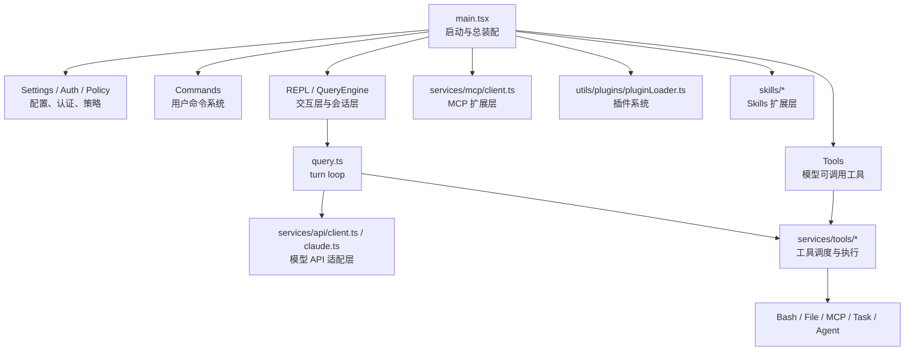
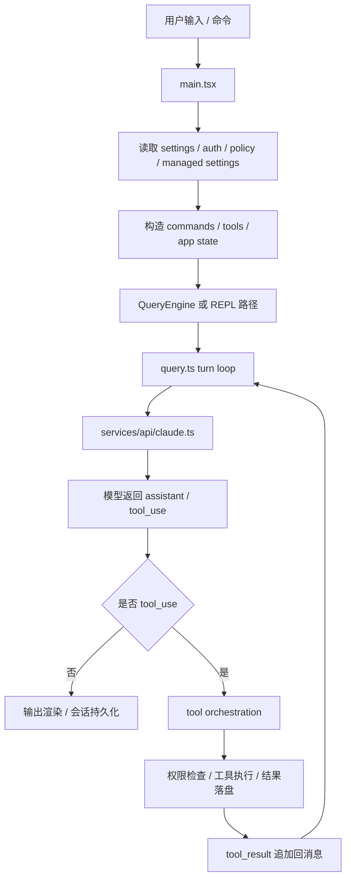
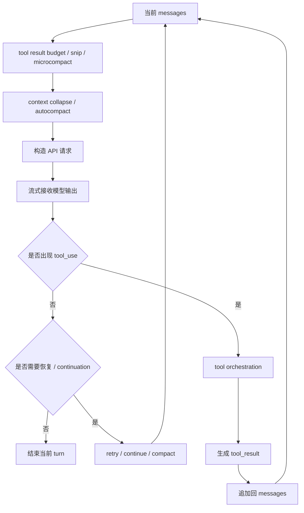

# Claude Code Source 代码走读

本文档是正式走读主稿。目标不是覆盖所有细节，而是先回答三个问题：

1. 这份仓库到底是什么
2. 它为什么能长期工作
3. 哪些设计值得借鉴，哪些地方已经形成结构债

如果想细看某块细节，请直接跳到后面的子文档：

- [06-走读附录：长会话与恢复机制.md](/Users/bobo/code/claude-code-source-code/docs/zh/06-走读附录：长会话与恢复机制.md)
- [07-走读附录：配置、认证与扩展系统.md](/Users/bobo/code/claude-code-source-code/docs/zh/07-走读附录：配置、认证与扩展系统.md)
- [08-走读附录：Claude Code 使用技巧.md](/Users/bobo/code/claude-code-source-code/docs/zh/08-走读附录：Claude Code 使用技巧.md)

## 导览图

### 架构总览

先只抓整体分层，不要一上来陷进实现细节。

一句话记忆：`main.tsx` 把系统装起来，`query.ts` 让系统跑起来，周边模块决定系统能做什么、不能做什么。

### 主执行链路

真正重要的是下面这条闭环：

后面正文基本就是把这条链拆开。

## 1. 先给结论：这份仓库到底是什么

这不是简单聊天 CLI，也不是薄薄的 SDK demo。它更接近一个完整的 terminal agent runtime，至少同时包含六层：

- CLI / TUI 交互层
- conversation host 与状态层
- LLM `turn loop` 与 tool calling 层
- 认证与 API 适配层
- 企业策略与远程托管控制层
- MCP / plugins / skills 扩展层

第一次读这份代码，先记住下面几个入口：

- [src/main.tsx](/Users/bobo/code/claude-code-source-code/src/main.tsx)：总入口与总装配
- [src/query.ts](/Users/bobo/code/claude-code-source-code/src/query.ts)：单次 turn 的执行内核
- [src/QueryEngine.ts](/Users/bobo/code/claude-code-source-code/src/QueryEngine.ts)：多轮会话宿主
- [src/Tool.ts](/Users/bobo/code/claude-code-source-code/src/Tool.ts) 和 [src/tools.ts](/Users/bobo/code/claude-code-source-code/src/tools.ts)：工具协议与注册中心
- [src/services/](/Users/bobo/code/claude-code-source-code/src/services/)：API、MCP、策略、插件等产品化能力

## 2. 阅读地图

如果是第一次进入仓库，建议按这个顺序：

1. [src/main.tsx](/Users/bobo/code/claude-code-source-code/src/main.tsx)
2. [src/query.ts](/Users/bobo/code/claude-code-source-code/src/query.ts)
3. [src/QueryEngine.ts](/Users/bobo/code/claude-code-source-code/src/QueryEngine.ts)
4. [src/Tool.ts](/Users/bobo/code/claude-code-source-code/src/Tool.ts)
5. [src/tools.ts](/Users/bobo/code/claude-code-source-code/src/tools.ts)
6. [src/services/api/client.ts](/Users/bobo/code/claude-code-source-code/src/services/api/client.ts)
7. [src/services/api/claude.ts](/Users/bobo/code/claude-code-source-code/src/services/api/claude.ts)
8. [src/services/tools/toolExecution.ts](/Users/bobo/code/claude-code-source-code/src/services/tools/toolExecution.ts)
9. [src/utils/sessionStorage.ts](/Users/bobo/code/claude-code-source-code/src/utils/sessionStorage.ts)
10. [src/utils/conversationRecovery.ts](/Users/bobo/code/claude-code-source-code/src/utils/conversationRecovery.ts)

核心原则是：先读主链路，再读控制面和扩展面。

## 3. Claude Code 的 runtime 主链路

这一节只回答一个问题：从启动到真正完成一轮工具闭环，最关键的主链路是什么。

### 3.1 `main.tsx` 负责装配，不负责思考

[src/main.tsx](/Users/bobo/code/claude-code-source-code/src/main.tsx) 做的事情远超“解析参数后开始聊天”：

- 预热 keychain / MDM / 本地配置
- 初始化 telemetry、GrowthBook、远程设置、策略限制
- 初始化 plugins、skills、MCP
- 合并 settings
- 构造 commands、tools、permission mode
- 进入 REPL 或 headless 模式

可以把它理解成 runtime bootstrapper，而不是 conversation kernel。

### 3.2 `QueryEngine.ts` 和 `query.ts` 不是同一层

这里最容易读错。更准确的分工是：

- [src/query.ts](/Users/bobo/code/claude-code-source-code/src/query.ts)：`runtime kernel`
- [src/QueryEngine.ts](/Users/bobo/code/claude-code-source-code/src/QueryEngine.ts)：`conversation host`

两者差别在于：

- `query.ts` 决定一轮怎么跑  
  包括 model request、tool call、continue、retry、compact。
- `QueryEngine.ts` 决定一段会话怎么活  
  包括 transcript 预落盘、usage 聚合、file state、SDK/headless 投影。

如果把这两层混在一起，后面很多设计都会看不清。

### 3.3 `turn loop` 是 runtime kernel

[src/query.ts](/Users/bobo/code/claude-code-source-code/src/query.ts) 不是简单的“发一次请求然后返回”。它维护的是一个完整闭环：

1. 整理当前 `messages`
2. 做 context 治理
3. 调模型
4. 接收 streaming 输出
5. 如果出现 `tool_use`，执行工具
6. 把 `tool_result` 回灌到消息
7. 决定继续、恢复、compact 或结束

先看结构图：

重点不是“发起请求”，而是它维护了一条可继续、可恢复、可压缩的合法轨迹。

### 3.4 为什么说它更像 recovery graph，而不是线性 pipeline

普通 demo agent 常见结构是：

- 采样
- 如果有工具就执行
- 再采样

但这里还多了大量恢复分支：

- `prompt_too_long`
- `max_output_tokens`
- context collapse drain
- reactive compact
- continuation
- stop hook blocking

所以更准确地说，这里不是“采样 -> 工具 -> 返回”的线性流水线，而是带恢复分支的 turn state machine。

## 4. 为什么它能长期工作

这一节是整份走读的核心。Claude Code 和很多 demo agent 的真正差别，不在工具数量，而在它已经为“长时间工作”付过账。

### 4.1 transcript / recovery 维护的是可恢复会话，不是聊天记录

关键文件：

- [src/utils/sessionStorage.ts](/Users/bobo/code/claude-code-source-code/src/utils/sessionStorage.ts)
- [src/utils/conversationRecovery.ts](/Users/bobo/code/claude-code-source-code/src/utils/conversationRecovery.ts)

这里最值得先记住的几个点：

- transcript 保存的是带 `parentUuid` 的消息链
- progress message 不进入主链
- compact boundary 是恢复协议的一部分
- resume 时不是直接反序列化，而是先把历史修回 API 可继续状态

所以 recovery 的目标不是“还原 UI”，而是“恢复一个还能继续跑的 runtime”。

想细看这一层，请读：
- [06-走读附录：长会话与恢复机制.md](/Users/bobo/code/claude-code-source-code/docs/zh/06-走读附录：长会话与恢复机制.md)

### 4.2 tool result budget / content replacement 解决的是“冻结输出命运”

关键文件：

- [src/utils/toolResultStorage.ts](/Users/bobo/code/claude-code-source-code/src/utils/toolResultStorage.ts)
- [src/services/compact/microCompact.ts](/Users/bobo/code/claude-code-source-code/src/services/compact/microCompact.ts)

这一层解决的不是“截断输出”，而是：

- 大工具输出先落盘
- 上下文里只保留稳定 preview
- 某个 `tool_use_id` 一旦替换，后面始终使用同一 replacement string
- 恢复后还要重放同一 replacement，保护 prompt cache prefix

这层非常值钱，因为它说明 Claude Code 在认真维护长会话的稳定性，而不是简单把大文本塞进上下文。

### 4.3 compact 的价值不是“做摘要”，而是“重建工作面”

关键文件：

- [src/services/compact/compact.ts](/Users/bobo/code/claude-code-source-code/src/services/compact/compact.ts)
- [src/services/compact/autoCompact.ts](/Users/bobo/code/claude-code-source-code/src/services/compact/autoCompact.ts)
- [src/services/compact/microCompact.ts](/Users/bobo/code/claude-code-source-code/src/services/compact/microCompact.ts)

compact 在这套系统里至少分几层：

- `microcompact`
- `snip`
- `context collapse`
- `autocompact`
- `reactive compact`

真正重要的不是名字，而是 compact 后保留了什么：

- `compact boundary`
- summary
- `messagesToKeep`
- 文件恢复 attachment
- `plan_mode`
- `invoked_skills`
- deferred tools / agents / MCP delta

所以它不是“把历史压成一段摘要”，而是在重建一个可继续工作的最小 context。

更详细的触发条件和流程，见：
- [06-走读附录：长会话与恢复机制.md](/Users/bobo/code/claude-code-source-code/docs/zh/06-走读附录：长会话与恢复机制.md)

## 5. 工具、权限和任务系统怎么协同

这一节回答：模型为什么不只是“会调工具”，而是被放在一个完整的能力和约束框架里。

### 5.1 `attachments.ts` 不是附件工具箱，而是 context router

关键文件：

- [src/utils/attachments.ts](/Users/bobo/code/claude-code-source-code/src/utils/attachments.ts)

每轮真正送给模型的 context，不只是 `messages + system prompt`，还会按 turn 重新注入：

- memories
- dynamic skills
- `plan_mode`
- deferred tools delta
- mailbox / team context

这就是为什么 `attachments.ts` 更像“第二调度层”，而不是简单附件模块。

### 5.2 `skills` 是 capability surface，不只是 prompt 片段

关键文件：

- [src/skills/loadSkillsDir.ts](/Users/bobo/code/claude-code-source-code/src/skills/loadSkillsDir.ts)
- [src/utils/processUserInput/processSlashCommand.tsx](/Users/bobo/code/claude-code-source-code/src/utils/processUserInput/processSlashCommand.tsx)

更准确地说：

- skill 被扫描到时，只是 capability 可见
- 真正调用 skill 时，正文才注入 context
- conditional skill 会跟文件路径和当前工作面绑定

所以 skill 在这套系统里更像“能力单元”，不是普通 markdown 提示词。

### 5.3 tool call 的真实边界在 execution pipeline

关键文件：

- [src/services/tools/toolExecution.ts](/Users/bobo/code/claude-code-source-code/src/services/tools/toolExecution.ts)
- [src/utils/permissions/](/Users/bobo/code/claude-code-source-code/src/utils/permissions/)

一次 tool call 不是 `findToolByName -> tool.call(input)` 这么短。实际还包含：

- schema parse
- validate / normalize input
- hooks
- classifier
- permission
- `tool.call()`
- result processing
- post hooks

这也是为什么 Claude Code 的 autonomy boundary 不在 UI，而在 runtime pipeline 本身。

### 5.4 task / subagent / mailbox 是异步执行底座

关键文件：

- [src/Task.ts](/Users/bobo/code/claude-code-source-code/src/Task.ts)
- [src/utils/task/framework.ts](/Users/bobo/code/claude-code-source-code/src/utils/task/framework.ts)
- [src/tools/AgentTool/runAgent.ts](/Users/bobo/code/claude-code-source-code/src/tools/AgentTool/runAgent.ts)
- [src/utils/teammateMailbox.ts](/Users/bobo/code/claude-code-source-code/src/utils/teammateMailbox.ts)

这里最重要的结论不是“它支持多 agent”，而是：

- task 被建模成一等执行体
- subagent 有独立 transcript 和 metadata
- mailbox 是显式通信协议
- 消息投递发生在 turn 边界，不会随意打断当前 state machine

这一层更像 actor runtime，而不是工具里顺手起一个后台线程。

## 6. 为什么它像产品化 runtime

这一节只保留最关键的产品化控制面，不在主稿里展开所有细节。

### 6.1 配置、认证和策略不是外围配件，而是控制面

关键文件：

- [src/utils/settings/settings.ts](/Users/bobo/code/claude-code-source-code/src/utils/settings/settings.ts)
- [src/utils/auth.ts](/Users/bobo/code/claude-code-source-code/src/utils/auth.ts)
- [src/services/remoteManagedSettings/index.ts](/Users/bobo/code/claude-code-source-code/src/services/remoteManagedSettings/index.ts)
- [src/services/policyLimits/index.ts](/Users/bobo/code/claude-code-source-code/src/services/policyLimits/index.ts)

代码里能直接看到：

- 多来源 settings merge
- OAuth / API key / third-party provider
- 组织级 policy limits
- 远程 managed settings
- `forceLoginOrgUUID` 一类组织绑定要求

职责边界也很清楚：

- 服务端负责裁决
- 客户端负责执行

细节请读：
- [07-走读附录：配置、认证与扩展系统.md](/Users/bobo/code/claude-code-source-code/docs/zh/07-走读附录：配置、认证与扩展系统.md)

### 6.2 API、prompt、MCP、plugins 都是一级扩展面

关键文件：

- [src/services/api/client.ts](/Users/bobo/code/claude-code-source-code/src/services/api/client.ts)
- [src/services/api/claude.ts](/Users/bobo/code/claude-code-source-code/src/services/api/claude.ts)
- [src/utils/systemPrompt.ts](/Users/bobo/code/claude-code-source-code/src/utils/systemPrompt.ts)
- [src/services/mcp/client.ts](/Users/bobo/code/claude-code-source-code/src/services/mcp/client.ts)
- [src/utils/plugins/pluginLoader.ts](/Users/bobo/code/claude-code-source-code/src/utils/plugins/pluginLoader.ts)

从实现上看：

- API 层是多 provider 统一适配层
- prompt stack 是 runtime control plane
- MCP / plugins / commands / skills 都是一级扩展面

这也是为什么整套系统读起来不像本地小工具，而像可持续演化的产品 runtime。

### 6.3 可观测性不是锦上添花，而是必要条件

关键文件：

- [src/utils/queryProfiler.ts](/Users/bobo/code/claude-code-source-code/src/utils/queryProfiler.ts)
- [src/utils/analyzeContext.ts](/Users/bobo/code/claude-code-source-code/src/utils/analyzeContext.ts)
- [src/services/api/promptCacheBreakDetection.ts](/Users/bobo/code/claude-code-source-code/src/services/api/promptCacheBreakDetection.ts)

这几块代码说明系统不仅在“跑”，还在尝试解释：

- 为什么这一轮变慢
- 上下文是谁吃掉的
- prompt cache 为什么断了

没有这层能力，就很难持续优化 harness。

## 7. 值得借鉴什么，结构债又在哪里

这一节是正式分享里必须有的收束：哪些设计值得学，哪些地方不该照抄。

### 7.1 最值得借鉴的，不是模块拆分，而是几条硬约束

从代码里最值得提炼的，不是某个具体函数，而是这些运行时约束：

- `tool_use -> tool_result` 必须闭合
- transcript 必须可恢复
- 大工具输出不能任意漂移命运
- context 需要分层治理，而不是只等 overflow 后做摘要
- 能力面要按时机和工作面展开
- autonomy boundary 要体现在 runtime pipeline，而不是只体现在 UI 上
- 异步执行体要有统一 task substrate

这些才是 Claude Code 区别于 demo agent 的核心。

### 7.2 主要结构债在 owner 不清，而不只是“大文件很多”

代码质量的主要问题不只是大文件，而是若干关键约束还没有单独 owner：

- [src/query.ts](/Users/bobo/code/claude-code-source-code/src/query.ts) 已经接近 God Loop
- `ToolUseContext` 过胖，容易变成高耦合总线
- cache invariants 分散在多个文件里维护
- continuity surface 很多，但 taxonomy 不统一
- permissions / tasks / remote execution 已经上升成 control plane，但实现仍分散

所以这份代码最适合被看成“生产工程样本”，而不是“下一代架构模板”。

## 8. 延伸阅读

如果你想把主稿里的某块细看，可以直接读这些子文档：

- [06-走读附录：长会话与恢复机制.md](/Users/bobo/code/claude-code-source-code/docs/zh/06-走读附录：长会话与恢复机制.md)
  包括 `transcript / recovery`、`tool result budget`、`compact`、状态载体、调试入口
- [07-走读附录：配置、认证与扩展系统.md](/Users/bobo/code/claude-code-source-code/docs/zh/07-走读附录：配置、认证与扩展系统.md)
  包括 settings、auth、policy、remote managed settings、API、prompt、MCP、plugins
- [08-走读附录：Claude Code 使用技巧.md](/Users/bobo/code/claude-code-source-code/docs/zh/08-走读附录：Claude Code 使用技巧.md)
  包括任务描述模板、prompt 建议、使用偏好

已有专题文档也建议按兴趣搭配阅读：

- [01-遥测与隐私分析.md](/Users/bobo/code/claude-code-source-code/docs/zh/01-遥测与隐私分析.md)
- [04-远程控制与紧急开关.md](/Users/bobo/code/claude-code-source-code/docs/zh/04-远程控制与紧急开关.md)
- [05-未来路线图.md](/Users/bobo/code/claude-code-source-code/docs/zh/05-未来路线图.md)

## 9. 总结

如果只用一句话概括：

Claude Code 本质上是一个围绕 `turn loop` 构建的、可被企业管理的、可扩展的 terminal agent runtime。

如果后面还会回来继续读源码，最值得先记住三条线：

- `main.tsx -> QueryEngine.ts -> query.ts`
- `query.ts -> toolExecution -> tool_result`
- `settings / auth / policy -> 本地执行`

只要先把这三条线读通，后面的 MCP、plugins、skills、remote session、subagent、memory 都会更容易进入。
