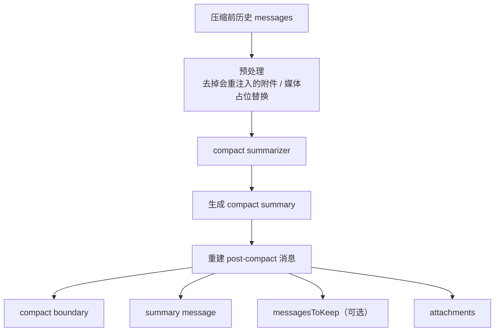

# 走读附录：长会话与恢复机制

这份附录展开主稿里“为什么它能长期工作”这一部分，重点看五块：

- `transcript / recovery`
- `tool result budget / content replacement`
- `compact`
- 关键状态载体
- 调试入口

对应主稿：
- [00-代码总览与运行时走读.md](/Users/bobo/code/claude-code-source-code/docs/zh/00-代码总览与运行时走读.md)

## 1. transcript / recovery：为什么会话可以恢复

关键文件：

- [src/utils/sessionStorage.ts](/Users/bobo/code/claude-code-source-code/src/utils/sessionStorage.ts)
- [src/utils/conversationRecovery.ts](/Users/bobo/code/claude-code-source-code/src/utils/conversationRecovery.ts)
- [src/QueryEngine.ts](/Users/bobo/code/claude-code-source-code/src/QueryEngine.ts)

### transcript 存的不是普通聊天记录

从 `sessionStorage.ts` 看，Claude Code 持久化的不是简单的 user / assistant 文本，而是一条带 `parentUuid` 的消息链。几个关键点：

- transcript message 和 progress message 被明确区分
- 只有真正参与因果链的消息才进入主链
- compact boundary 也是 transcript 的一部分

换句话说，这层的目标不是“把历史存下来”，而是“把一条还能重建的会话链存下来”。

### recovery 不是反序列化，而是修回 API 合法状态

`conversationRecovery.ts` 的恢复路径至少会做这些事：

1. 读取 transcript
2. 恢复 skill state、plan、file history 等 sidecar 状态
3. 过滤 unresolved `tool_use`
4. 过滤 orphaned thinking-only assistant messages
5. 过滤空白 assistant 消息
6. 判断上一轮是正常结束还是中断
7. 必要时插入 synthetic continuation
8. 保证恢复后的序列重新变成 API 可继续状态

所以 recovery 的目标不是“忠实还原磁盘内容”，而是“把系统重新放回可运行状态”。

### synthetic continuation 的意义

恢复时如果发现上一轮是半途中断，系统不会停在坏掉的断点上，而是补一条类似 “Continue from where you left off.” 的 synthetic user message，再把它送回 turn loop。

这说明：

- 中断会被转换成一种可继续状态
- resume 行为更像“接管一个未完成的 runtime”，不是“回放聊天记录”

### compact boundary 的作用

compact boundary 不只是 UI 提示，它还是恢复协议的一部分：

- 标记 pre-compact 和 post-compact 的边界
- 携带 compact metadata
- 告诉恢复逻辑哪些历史已经被 summary 替代

## 2. tool result budget / content replacement

关键文件：

- [src/utils/toolResultStorage.ts](/Users/bobo/code/claude-code-source-code/src/utils/toolResultStorage.ts)
- [src/services/compact/microCompact.ts](/Users/bobo/code/claude-code-source-code/src/services/compact/microCompact.ts)
- [src/services/api/claude.ts](/Users/bobo/code/claude-code-source-code/src/services/api/claude.ts)

### 这层解决的不是“截断输出”

最重要的状态是：

- `seenIds`
- `replacements`

它表达的核心约束是：

- 某个 `tool_use_id` 一旦进入预算判断，它后续是否替换就被冻结
- 已经替换过的结果，后面必须复用完全相同的 replacement string
- 没替换过的结果，后面也不能突然改成替换

这么做的目的不是简单省 token，而是保护 prompt cache prefix 稳定。

### 大 tool result 怎么处理

当工具输出很大时，系统优先：

1. 把完整结果写到 session 目录
2. 生成固定格式的 preview
3. 在消息里用 preview 替换原始大输出

模型最终看到的是：

- 文件路径
- preview
- “完整结果已持久化”的提示

而不是一段随机截断的文本。

### 两层预算

代码里至少有两层：

- per-tool limit  
  单个工具自己的大输出先被持久化替换
- per-message aggregate budget  
  多个 `tool_result` 合并后，整体过大时再做一层 replacement

第二层很重要，因为 API 层会合并连续 user messages。

### 为什么 resume 后 replacement 还能稳定

因为 replacement record 会持久化。恢复时系统会：

- 根据 transcript 中的 records 重建 replacement state
- 对已经替换过的 `tool_use_id` 重新应用相同 replacement string
- 对已看过但未替换的结果继续保持 frozen

这让 Claude Code 获得了跨 resume 的 prefix stability。

## 3. compact：context compaction 是怎么工作的

关键文件：

- [src/services/compact/autoCompact.ts](/Users/bobo/code/claude-code-source-code/src/services/compact/autoCompact.ts)
- [src/services/compact/compact.ts](/Users/bobo/code/claude-code-source-code/src/services/compact/compact.ts)
- [src/services/compact/microCompact.ts](/Users/bobo/code/claude-code-source-code/src/services/compact/microCompact.ts)
- [src/services/compact/sessionMemoryCompact.ts](/Users/bobo/code/claude-code-source-code/src/services/compact/sessionMemoryCompact.ts)

### 各种 compact 的触发条件

#### `microcompact`

- 几乎每轮都会先经过
- 通常只对可 compact 的工具结果生效
- 重点是轻量整理，不是 conversation summary

#### `snip`

- 在 `microcompact` 之前执行
- 主要按裁剪规则移除一部分旧消息
- 更像 history trimming

#### `context collapse`

- 在 `microcompact` 之后、`autocompact` 之前尝试
- 目标是先用更便宜的 collapse 保住细粒度上下文
- 优先级高于 full autocompact

#### `autocompact`

- 按 token threshold 主动触发
- 属于 proactive compaction
- 发生在真正撞到 API 极限之前

#### `reactive compact`

- 在 `prompt_too_long` 之后触发
- 属于 recovery path
- 通常在更便宜的恢复动作之后才进入

#### `/compact`

- 用户显式调用时触发
- 不依赖 threshold
- 走 full compact 路径

### full compact 的流程

真正关键的不是 summary，而是 post-compact attachments，它们用来重建工作面。

### compact 后到底保留什么

- compact boundary
- summary
- `messagesToKeep`
- 文件恢复 attachment
- `plan_mode`
- `invoked_skills`
- deferred tools / agents / MCP delta
- hook results

所以 compact 不是“删旧消息”，而是“换成 boundary + summary + 必要附件”。

## 4. 关键状态载体

这套 runtime 的状态并不只在 `messages` 里。

### `messages`

- `query.ts` 的直接工作面
- 决定当前 turn 怎么跑
- 但不是系统唯一真相

### transcript / sidechain transcript

- durable history
- 支撑 recovery、subagent resume、task continuity

### `ToolUseContext`

- 工具执行总线
- 暴露 commands、tools、mcpClients、readFileState、AppState bridge

### `AppState`

- 宿主共享状态总线
- 持有 tasks、permission context、plugins、mcp、todo、diagnostics 等

### attachments / sidecar artifacts

- 按需重注入的工作面
- 包括 memories、skills、plan、mailbox、task outputs、replacement records

更准确的理解方式是三层：

- turn-local：`messages`
- host-wide：`AppState`
- durable / on-demand：transcript + attachments + sidecar artifacts

## 5. 调试入口

### 如果问题出在 turn loop

先看：

- [src/query.ts](/Users/bobo/code/claude-code-source-code/src/query.ts)
- [src/QueryEngine.ts](/Users/bobo/code/claude-code-source-code/src/QueryEngine.ts)

### 如果问题出在 context 太大或 cache 漂移

先看：

- [src/services/compact/compact.ts](/Users/bobo/code/claude-code-source-code/src/services/compact/compact.ts)
- [src/services/compact/microCompact.ts](/Users/bobo/code/claude-code-source-code/src/services/compact/microCompact.ts)
- [src/utils/analyzeContext.ts](/Users/bobo/code/claude-code-source-code/src/utils/analyzeContext.ts)
- [src/services/api/promptCacheBreakDetection.ts](/Users/bobo/code/claude-code-source-code/src/services/api/promptCacheBreakDetection.ts)

### 如果问题出在工具没跑或被拒绝

先看：

- [src/services/tools/toolExecution.ts](/Users/bobo/code/claude-code-source-code/src/services/tools/toolExecution.ts)
- [src/services/tools/toolHooks.ts](/Users/bobo/code/claude-code-source-code/src/services/tools/toolHooks.ts)
- [src/utils/permissions/](/Users/bobo/code/claude-code-source-code/src/utils/permissions/)

### 如果问题出在 resume 或恢复

先看：

- [src/utils/sessionStorage.ts](/Users/bobo/code/claude-code-source-code/src/utils/sessionStorage.ts)
- [src/utils/conversationRecovery.ts](/Users/bobo/code/claude-code-source-code/src/utils/conversationRecovery.ts)

### 如果问题出在多 agent / task / mailbox

先看：

- [src/utils/task/framework.ts](/Users/bobo/code/claude-code-source-code/src/utils/task/framework.ts)
- [src/tools/AgentTool/runAgent.ts](/Users/bobo/code/claude-code-source-code/src/tools/AgentTool/runAgent.ts)
- [src/utils/teammateMailbox.ts](/Users/bobo/code/claude-code-source-code/src/utils/teammateMailbox.ts)
