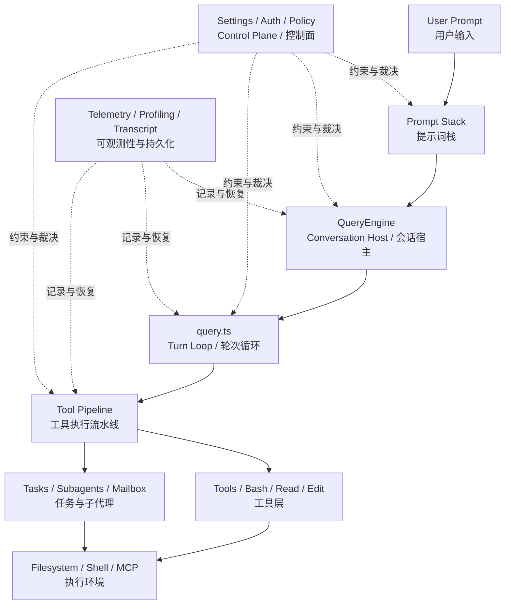

# Claude Code 使用技巧与注意事项：分享提纲

这份提纲用于支撑后续 PPT。它不是完整正文，而是“每一页讲什么、素材是什么、源码依据在哪里”。

对应正文：
- [09-Claude Code 使用技巧与注意事项.md](/Users/bobo/code/claude-code-source-code/docs/zh/09-Claude%20Code%20使用技巧与注意事项.md)

## 开场定位

这份分享不是 Claude Code 的功能介绍，也不是产品评测。它解决的是一个更实际的问题：

- 为什么同样是 Claude Code，有的人越用越顺，有的人越用越乱
- 为什么有些 prompt 一次就能得到稳定结果，有些 prompt 会让系统过度发挥
- 从源码看，用户到底该怎样组织任务，才能更贴近它默认的工作方式

如果现场时间有限，这份提纲建议优先保留 4 个核心部分：

1. Claude Code 从工程上是什么
2. 它默认鼓励什么行为
3. 哪 6 条用户技巧最重要
4. 哪些误用最容易让结果失稳

## 术语对照

这组术语建议在 PPT 中统一按“英文术语（中文对照）”展示。

| 英文术语 | 中文对照 |
| --- | --- |
| `terminal agent runtime` | 终端代理运行时 |
| `prompt stack` | 提示词栈 |
| `conversation host` | 会话宿主 |
| `turn loop` | 轮次循环 |
| `runtime kernel` | 运行时内核 |
| `tool pipeline` | 工具执行流水线 |
| `control plane` | 控制面 |
| `Plan Mode workflow` | 规划模式工作流 |
| `dedicated tools` | 专用工具 |
| `parallel` | 并行 |
| `software engineering tasks` | 软件工程任务 |

## 0. 开场总结构图

用途：
- 这张图放在封面之后，用来先建立 Claude Code 的整体模型
- 它回答的问题不是“每个模块怎么实现”，而是“使用技巧为什么会受到这些架构层影响”

本页一句话：
- Claude Code 的使用技巧，本质上是在影响 `prompt stack（提示词栈） -> turn loop（轮次循环） -> tool pipeline（工具执行流水线）` 这条主执行链。

建议讲法：
- 最上层是用户输入
- 中间是 `prompt stack（提示词栈）`、`turn loop（轮次循环）`、`tool pipeline（工具执行流水线）`
- 下层是 tools / tasks / filesystem / shell
- 右侧是 settings / auth / policy 这些 `control plane（控制面）`
- 结论是：用户使用技巧之所以有效，是因为它们在影响这条主执行链和外围控制面

UML 总览图：



这一页讲什么：
- Claude Code 不是自由聊天助手，而是一个 `terminal agent runtime（终端代理运行时）`
- 用户输入不会直接变成输出，而是经过 `prompt stack（提示词栈） -> turn loop（轮次循环） -> tool pipeline（工具执行流水线）`
- 使用技巧的作用，本质上是在影响这条链路的稳定性

这一页要强调：
- 不要急着讲细节实现
- 先让听众知道“用户输入会穿过哪些层”
- 后面所有技巧，本质上都是对这条链的干预

架构支撑：
- `main.tsx` 负责整体 assembly
- `QueryEngine.ts` 负责 `conversation host（会话宿主）`
- `query.ts` 负责 `turn loop（轮次循环）`
- `toolExecution.ts` 负责 `tool pipeline（工具执行流水线）`
- settings / auth / policy 构成 `control plane（控制面）`

源码依据：
- [main.tsx](/Users/bobo/code/claude-code-source-code/src/main.tsx)
- [QueryEngine.ts](/Users/bobo/code/claude-code-source-code/src/QueryEngine.ts)
- [query.ts](/Users/bobo/code/claude-code-source-code/src/query.ts)
- [toolExecution.ts](/Users/bobo/code/claude-code-source-code/src/services/tools/toolExecution.ts)

过渡到下一页：
- 先有这个整体模型，下一步才容易理解 Claude Code 在用户侧“默认不是什么”。

## 1. 封面

标题：
- `Claude Code 使用技巧与注意事项`

副标题：
- `从源码反推的用户侧最佳实践`

讲述目标：
- 这不是功能介绍，而是使用方法论
- 所有建议都来自源码，不是个人经验

建议开场白：
- “这份分享不讨论 Claude Code 强不强，而讨论怎样用会更稳定。”
- “重点不是功能覆盖，而是把源码里的默认工作方式翻译成用户可执行的提示方法。”

过渡到下一页：
- 先做预期管理，再谈技巧，否则后面的建议会被误解成“使用偏好”而不是“系统默认工作方式”。

## 2. 先给结论：Claude Code 不是什么

本页一句话：
- Claude Code 不是自由聊天助手，而是默认按 `software engineering tasks（软件工程任务）` 来理解用户请求。

核心信息：
- 不是自由聊天助手
- 不是“随便说一句就稳定帮你把工程活干好”
- 更像软件工程代理
- 输入越工程化，表现通常越稳定

这一页要补的解释：
- 这里不是贬低它的能力，而是在做预期管理
- 如果一开始把它当“自由聊天助手”，后面几乎所有技巧都会显得多余
- 一旦接受它是“软件工程代理”这个定位，后面的技巧就都合理了

架构支撑：
- `prompt stack（提示词栈）` 把 Claude Code 的默认角色定义成软件工程代理，而不是自由聊天助手

源码依据：
- [prompts.ts#L221](/Users/bobo/code/claude-code-source-code/src/constants/prompts.ts#L221)

关键代码片段：

```ts
The user will primarily request you to perform software engineering tasks.
```

过渡到下一页：
- 既然它默认按工程任务理解输入，接下来就要说明这套系统在源码里到底由哪些层组成。

## 3. 从源码看：Claude Code 是什么

本页一句话：
- Claude Code 是一个 `terminal agent runtime（终端代理运行时）`，不是只包了一层模型 API 的 CLI。

核心信息：
- `main.tsx`：`bootstrap / assembly（启动 / 装配）`
- `QueryEngine.ts`：`conversation host（会话宿主）`
- `query.ts`：`turn loop / runtime kernel（轮次循环 / 运行时内核）`
- `toolExecution.ts`：`tool pipeline（工具执行流水线）`
- settings / auth / prompt / policy：`control plane（控制面）`

讲述重点：
- 先建立“`terminal agent runtime（终端代理运行时）`”这个模型
- 说明它默认按软件工程任务运行

可补充的讲点：
- `main.tsx` 不是智能核心，而是装配入口
- `QueryEngine.ts` 和 `query.ts` 的分工，决定了它不是“一次问答就结束”的结构
- `toolExecution.ts` 的存在，说明它不是模型直接碰系统，而是要经过执行流水线

架构支撑：
- `main.tsx` 负责 assembly
- `QueryEngine.ts` 负责 `conversation host（会话宿主）`
- `query.ts` 负责 `turn loop（轮次循环）`
- `toolExecution.ts` 负责 `tool pipeline（工具执行流水线）`

源码依据：
- [main.tsx](/Users/bobo/code/claude-code-source-code/src/main.tsx)
- [QueryEngine.ts](/Users/bobo/code/claude-code-source-code/src/QueryEngine.ts)
- [query.ts](/Users/bobo/code/claude-code-source-code/src/query.ts)

关键代码点：
- `main.tsx` 负责 settings / auth / tools / plugins / MCP 的 assembly
- `QueryEngine.ts` 持有 messages、usage、file state、transcript
- `query.ts` 负责 `model -> tool -> model` 的 turn loop

关键代码片段：

```ts
export class QueryEngine {
  private mutableMessages: Message[]
  private totalUsage: NonNullableUsage
  private readFileState: FileStateCache
}
```

```ts
type State = {
  messages: Message[]
  toolUseContext: ToolUseContext
  turnCount: number
  transition: Continue | undefined
}
```

过渡到下一页：
- 结构知道以后，下一步要看这套 runtime 默认鼓励什么行为、抑制什么行为。

## 4. 从源码反推：默认偏好的工作方式

本页一句话：
- 后面的所有使用技巧，都是把 Claude Code 源码里的默认偏好显式写进用户提示里。

核心信息：
- 先读代码
- 最小改动
- 优先复用
- 优先 `dedicated tools（专用工具）`
- 验证后如实汇报
- 高风险动作先确认

讲述重点：
- 后面所有技巧都从这些偏好推导出来

建议展开方式：
- 这一页不要平均展开 6 条偏好
- 重点只讲 3 条：先读代码、最小改动、如实汇报
- 其余三条作为后面技巧页的铺垫

架构支撑：
- 这些偏好主要落在 `prompt stack（提示词栈）`
- 执行层再由 `tool pipeline（工具执行流水线）` 和权限系统兜底

源码依据：
- [prompts.ts#L230](/Users/bobo/code/claude-code-source-code/src/constants/prompts.ts#L230)
- [prompts.ts#L203](/Users/bobo/code/claude-code-source-code/src/constants/prompts.ts#L203)
- [prompts.ts#L305](/Users/bobo/code/claude-code-source-code/src/constants/prompts.ts#L305)
- [prompts.ts#L240](/Users/bobo/code/claude-code-source-code/src/constants/prompts.ts#L240)
- [prompts.ts#L258](/Users/bobo/code/claude-code-source-code/src/constants/prompts.ts#L258)

关键代码点：
- `do not propose changes to code you haven't read`
- `Don't create helpers ... for one-time operations`
- `Do NOT use the Bash tool ... when a relevant dedicated tool is provided`
- `Report outcomes faithfully`
- `ask for confirmation before proceeding`

关键代码片段：

```ts
In general, do not propose changes to code you haven't read.
```

```ts
Do NOT use the Bash tool to run commands when a relevant dedicated tool is provided.
```

```ts
Report outcomes faithfully: if tests fail, say so ...
```

```ts
ask for confirmation before proceeding
```

过渡到下一页：
- 先从最重要的一条开始：任务应该怎样描述，Claude Code 才最容易稳。

## 5. 技巧 1：任务写成“目标 + 范围 + 约束 + 验证”

本页一句话：
- 最稳定的输入方式，是把任务写成“目标 + 范围 + 约束 + 验证”。

推荐写法：

```text
目标：修复/实现……
范围：只改 …… 相关代码
约束：不要做无关重构；不要新增不必要文件
验证：运行 …… 测试，并说明结果
```

为什么有效：
- 能减少分析 / 实现 / 顺手优化之间的歧义

适合场景：
- 修 bug
- 小功能
- 局部重构
- 需要明确验收标准的任务

架构支撑：
- `prompt stack（提示词栈）` 默认把请求理解成软件工程任务
- `turn loop（轮次循环）` 会围绕用户给出的目标、范围和验证要求持续推进

源码依据：
- [prompts.ts#L221](/Users/bobo/code/claude-code-source-code/src/constants/prompts.ts#L221)
- [prompts.ts#L230](/Users/bobo/code/claude-code-source-code/src/constants/prompts.ts#L230)
- [prompts.ts#L240](/Users/bobo/code/claude-code-source-code/src/constants/prompts.ts#L240)

关键代码点：
- `software engineering tasks`
- `do not propose changes to code you haven't read`
- `Report outcomes faithfully`

关键代码片段：

```ts
The user will primarily request you to perform software engineering tasks.
```

```ts
In general, do not propose changes to code you haven't read.
```

```ts
Report outcomes faithfully: if tests fail, say so ...
```

过渡到下一页：
- 任务结构定完以后，第二个最重要的动作是要求它先读代码，而不是先动手。

## 6. 技巧 2：明确要求先读代码，再改代码

本页一句话：
- “先读代码，再改代码”不是建议项，而是 Claude Code 源码里的默认工作顺序。

推荐写法：

```text
先看 src/foo.ts 和 src/bar.ts，再决定改法。
```

为什么有效：
- 符合系统默认工作顺序
- 能减少无关探索

适合场景：
- 老代码库
- 目录复杂的项目
- 用户已经知道关键文件的大概位置

架构支撑：
- `prompt stack（提示词栈）` 明确要求先读代码
- `Plan Mode workflow（规划模式工作流）` 也要求先 explore，再规划或实现

源码依据：
- [prompts.ts#L230](/Users/bobo/code/claude-code-source-code/src/constants/prompts.ts#L230)
- [messages.ts#L3344](/Users/bobo/code/claude-code-source-code/src/utils/messages.ts#L3344)

关键代码点：
- `read it first`
- `Explore — Use ... to read code`
- `Look for existing functions, utilities, and patterns to reuse`

关键代码片段：

```ts
In general, do not propose changes to code you haven't read.
If a user asks about or wants you to modify a file, read it first.
```

```md
1. **Explore** — Use ${getReadOnlyToolNames()} to read code.
Look for existing functions, utilities, and patterns to reuse.
```

过渡到下一页：
- 读完以后，还需要进一步压住范围漂移，这就是“最小改动、优先复用”的作用。

## 7. 技巧 3：强调最小改动、优先复用

本页一句话：
- 把“最小改动、优先复用”写出来，能明显降低顺手重构和过早抽象。

推荐写法：

```text
做最小必要改动；优先复用现有函数、工具和模式；不要新造一层抽象。
```

为什么有效：
- 能压住顺手重构和过早抽象

适合场景：
- 用户只想修一个问题，不想顺手大改
- 需要快速交付
- 代码库已有明确风格和模式

架构支撑：
- `prompt stack（提示词栈）` 本身就在抑制范围漂移和不必要抽象
- `tool pipeline（工具执行流水线）` 更适合执行局部、清晰、可验证的改动

源码依据：
- [prompts.ts#L200](/Users/bobo/code/claude-code-source-code/src/constants/prompts.ts#L200)
- [prompts.ts#L203](/Users/bobo/code/claude-code-source-code/src/constants/prompts.ts#L203)

关键代码点：
- `Don't add features, refactor code, or make "improvements" beyond what was asked`
- `Don't create helpers, utilities, or abstractions for one-time operations`

关键代码片段：

```ts
Don't add features, refactor code, or make "improvements" beyond what was asked.
```

```ts
Don't create helpers, utilities, or abstractions for one-time operations.
```

过渡到下一页：
- 范围控制住之后，下一步要控制执行手段，也就是优先专用工具，而不是直接上 Bash。

## 8. 技巧 4：优先 dedicated tools（专用工具），不要默认 Bash

本页一句话：
- Claude Code 更偏好 `dedicated tools（专用工具）`，Bash 在源码里是 fallback，不是首选。

推荐写法：

```text
优先直接读写文件，不要用 Bash 做本可由专用工具完成的事情。
```

为什么有效：
- Bash 是 fallback，不是首选
- 专用工具更容易被解释和审查

适合场景：
- 文件搜索
- 文件读取
- 局部编辑
- 结果需要更可控、更可审查的任务

架构支撑：
- `tool pipeline（工具执行流水线）` 里 `dedicated tools（专用工具）` 是一等能力面
- Bash 是更自由也更高风险的 fallback surface

源码依据：
- [prompts.ts#L301](/Users/bobo/code/claude-code-source-code/src/constants/prompts.ts#L301)
- [prompts.ts#L305](/Users/bobo/code/claude-code-source-code/src/constants/prompts.ts#L305)
- [BashTool prompt#L297](/Users/bobo/code/claude-code-source-code/src/tools/BashTool/prompt.ts#L297)

关键代码点：
- `default to using the dedicated tool`
- `Do NOT use the Bash tool ...`
- `If the commands are independent and can run in parallel`

关键代码片段：

```ts
default to using the dedicated tool and only fallback on using the Bash tool ...
```

```ts
Do NOT use the Bash tool to run commands when a relevant dedicated tool is provided.
```

```ts
If the commands are independent and can run in parallel, make multiple Bash tool calls in a single message.
```

过渡到下一页：
- 执行手段选对以后，还要避免“看起来做完了，实际上没验证”的情况。

## 9. 技巧 5：验证要求要写清楚，而且要如实汇报

本页一句话：
- 不要默认 Claude Code 已经验证过，验证要求必须显式写出来。

推荐写法：

```text
改完后跑相关测试；如果没跑，请明确说明没有跑。
```

为什么有效：
- 可以减少“看似完成、其实没验证”的风险

适合场景：
- 修 bug 后回归
- CLI / 后端任务
- 有明确测试或命令可跑的场景

架构支撑：
- `prompt stack（提示词栈）` 明确要求 verify 和 faithful reporting
- `turn loop（轮次循环）` 默认不会替用户假设“验证已经完成”

源码依据：
- [prompts.ts#L211](/Users/bobo/code/claude-code-source-code/src/constants/prompts.ts#L211)
- [prompts.ts#L240](/Users/bobo/code/claude-code-source-code/src/constants/prompts.ts#L240)

关键代码点：
- `verify it actually works`
- `Never claim "all tests pass" when output shows failures`

关键代码片段：

```ts
Before reporting a task complete, verify it actually works.
```

```ts
Never claim "all tests pass" when output shows failures.
```

过渡到下一页：
- 除了验证，另一个必须显式收紧的是高风险动作的授权边界。

## 10. 技巧 6：高风险动作要显式要求先确认

本页一句话：
- 高风险动作先确认，不是额外保守，而是 Claude Code 的默认安全边界。

推荐写法：

```text
涉及 push、删除、覆盖、外部发送、破坏性 git 操作时，先告诉我并确认。
```

为什么有效：
- 这是系统默认的保守策略

适合场景：
- 涉及 git push / 删除 / 覆盖
- 可能影响工作区
- 可能产生外部副作用的操作

架构支撑：
- `prompt stack（提示词栈）` 先定义高风险动作的确认边界
- `tool pipeline（工具执行流水线）` 和 Bash 约束负责在执行面进一步收紧

源码依据：
- [prompts.ts#L258](/Users/bobo/code/claude-code-source-code/src/constants/prompts.ts#L258)
- [BashTool prompt#L304](/Users/bobo/code/claude-code-source-code/src/tools/BashTool/prompt.ts#L304)

关键代码点：
- `reversibility and blast radius`
- `ask for confirmation before proceeding`
- `Only use destructive operations when they are truly the best approach`

关键代码片段：

```ts
Carefully consider the reversibility and blast radius of actions.
```

```ts
ask for confirmation before proceeding
```

```ts
Only use destructive operations when they are truly the best approach.
```

过渡到下一页：
- 基础技巧讲完以后，再看两个会明显提升效率的进阶技巧：并行和规划模式。

## 11. 技巧 7：独立查询可以显式允许 parallel（并行）

本页一句话：
- 对彼此独立的查询，显式允许 `parallel（并行）`，能更贴近 Claude Code 的原生工作方式。

推荐写法：

```text
如果这些查询彼此独立，可以并行完成；不要重复做相同搜索。
```

为什么有效：
- 系统原生鼓励独立工具调用并行化

适合场景：
- 多文件查找
- 多目录对比
- 独立问题的并行调研

架构支撑：
- `tool pipeline（工具执行流水线）` 原生支持 independent tool calls 并行
- `Plan Mode workflow（规划模式工作流）` 也鼓励先并行探索，再收敛实现

源码依据：
- [prompts.ts#L310](/Users/bobo/code/claude-code-source-code/src/constants/prompts.ts#L310)
- [messages.ts#L3344](/Users/bobo/code/claude-code-source-code/src/utils/messages.ts#L3344)
- [BashTool prompt#L298](/Users/bobo/code/claude-code-source-code/src/tools/BashTool/prompt.ts#L298)

关键代码点：
- `make all independent tool calls in parallel`
- `parallelize complex searches`
- `If the commands are independent and can run in parallel`

关键代码片段：

```ts
make all independent tool calls in parallel
```

```md
1. **Explore** — Use ${getReadOnlyToolNames()} to read code.
Look for existing functions, utilities, and patterns to reuse.
```

```ts
If the commands are independent and can run in parallel, make multiple Bash tool calls ...
```

补充讲点：
- 这一页可以和 `Plan Mode workflow（规划模式工作流）` 放在同一页，作为两个进阶技巧一起讲。
- 如果想再加一个小框，可以补一句：`先探索，再规划，再实现`。

建议讲法：
- `parallel（并行）` 解决的是效率问题
- `Plan Mode workflow（规划模式工作流）` 解决的是不确定性问题
- 这两个技巧不一定每次都用，但一旦用对，收益会非常明显

过渡到下一页：
- 技巧讲完以后，最后需要收束成反面清单，也就是最容易让 Claude Code 失稳的几种用法。

## 12. 常见误区与注意事项

本页一句话：
- 大多数误用，本质上都在对抗 Claude Code 源码里的默认工作流。

核心信息：
- 不要把 Claude Code 当自由聊天助手
- 不要一上来让它大改一遍
- 不要默认它已经验证过
- 不要把高风险授权写得太模糊

建议强调：
- 这些误区并不是“用户不会提问”
- 它们本质上是在和系统默认工作流对着干
- 所以一旦踩中，Claude Code 的表现就容易发散

架构支撑：
- 这些误区本质上都在对抗 `prompt stack（提示词栈）` 的默认约束
- 一旦输入方式偏离默认工作流，`turn loop（轮次循环）` 的稳定性就更容易下降

源码依据：
- [prompts.ts#L221](/Users/bobo/code/claude-code-source-code/src/constants/prompts.ts#L221)
- [prompts.ts#L200](/Users/bobo/code/claude-code-source-code/src/constants/prompts.ts#L200)
- [prompts.ts#L240](/Users/bobo/code/claude-code-source-code/src/constants/prompts.ts#L240)
- [prompts.ts#L258](/Users/bobo/code/claude-code-source-code/src/constants/prompts.ts#L258)

关键代码点：
- `software engineering tasks`
- `Don't add features ... beyond what was asked`
- `Report outcomes faithfully`
- `ask for confirmation before proceeding`

关键代码片段：

```ts
The user will primarily request you to perform software engineering tasks.
```

```ts
Don't add features, refactor code, or make "improvements" beyond what was asked.
```

```ts
Report outcomes faithfully ...
```

```ts
ask for confirmation before proceeding
```

过渡到下一页：
- 最后一页只保留用户真正需要带走的 6 条，不再展开解释。

## 13. 最小使用清单

最终压成 6 条：

1. 任务写成“目标 + 范围 + 约束 + 验证”
2. 明确要求先读代码
3. 明确要求最小改动、优先复用
4. 优先 dedicated tools（专用工具），不要默认 Bash
5. 验证结果要如实汇报
6. 高风险动作先确认

本页一句话：
- 这 6 条就是可以直接拍照带走的 Claude Code 最小使用清单。

建议展示方式：
- 每条不超过一行半
- 只保留动词和结论，不再放源码
- 做成最后一页的“拍照页”

结尾建议：
- 最后一句不要收成“学会这些技巧就行”
- 更好的收束方式是：
  - “Claude Code 的关键不是多聪明，而是你能不能把任务组织成它默认擅长处理的样子。”
