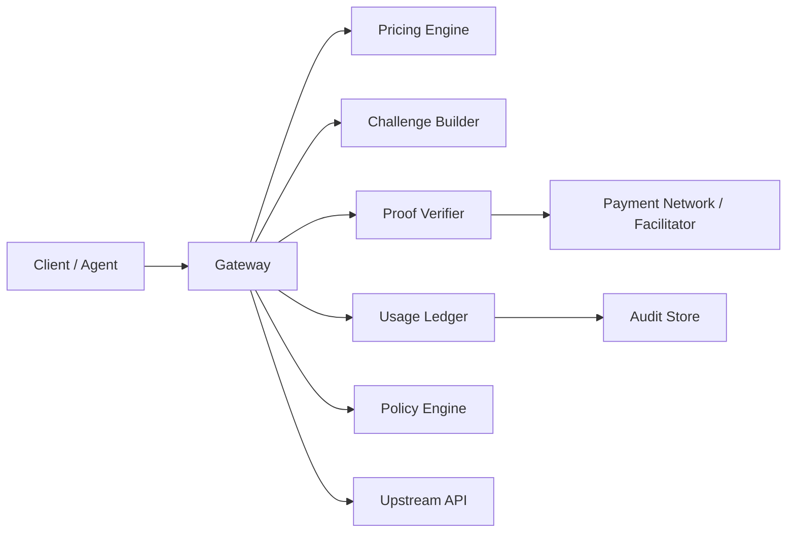

# pay.sh Gateway 设计文档

本文档讨论如何实现一个与 `pay.sh` 产品形态兼容的 provider-side gateway。这里的 gateway 指放在现有 API 前面的计费代理层：它不直接提供业务能力，而是负责价格发现、HTTP `402 Payment Required` challenge、支付 proof 校验、请求转发、审计和限额控制。

参考资料：

- [pay.sh docs](https://pay.sh/docs)
- [HTTP 402 lifecycle](https://pay.sh/docs/protocol/http-402)
- [MPP](https://pay.sh/docs/protocol/mpp)
- [x402](https://pay.sh/docs/protocol/x402)
- [Wallet approval and security](https://pay.sh/docs/protocol/security)
- [solana-foundation/pay README](https://github.com/solana-foundation/pay)

## 1. 背景和目标

`pay.sh` 的核心机制是：客户端或 agent 先正常请求 API；如果 API 需要付费，服务端返回 `402 Payment Required`；客户端解析 payment challenge，本地钱包授权签名；客户端带 payment proof 重试；服务端校验 proof 后返回真实业务响应。

官方文档对这个生命周期的描述是：

```text
client -> API: request resource
API -> client: 402 Payment Required
pay -> wallet: request local authorization
pay -> API: retry with payment proof
API -> client: 200 OK
```

因此 gateway 的目标不是做一个传统 API key 网关，而是把现有 API 包装成 agent 可以按次购买的能力。

核心目标：

- 对外暴露付费 API endpoint。
- 在未支付或 proof 无效时返回标准 `402` challenge。
- 支持至少一种支付协议，建议先支持 `x402`，再扩展 `MPP`。
- 将已支付请求安全转发到 upstream API。
- 记录 usage、payment、request、settlement 审计事件。
- 为 agent 使用提供安全边界：价格明确、限额明确、错误可解释。

非目标：

- 不实现完整钱包。
- 不托管用户私钥。
- 不替代 provider 的业务 API。
- 不在 gateway 内混入 agent prompt 或 provider 文案指令。

## 2. 产品视角

从产品角度，gateway 面向两类角色：

- Provider：希望把自己的 API 商品化，支持按次计费和 agent 调用。
- Client / Agent：希望在没有人工注册、申请 API key、绑定套餐的情况下完成一次明确价格的 API 调用。

gateway 的产品价值是缩短交易链路：

```text
传统模式：
注册账号 -> 绑定支付方式 -> 创建 API key -> 配置 SDK -> 调用 API

pay.sh gateway 模式：
调用 API -> 收到 402 价格挑战 -> 本地授权支付 -> 带 proof 重试 -> 获取结果
```

对 provider 来说，它更像一个 agent-native distribution channel，而不是单纯支付按钮。对用户来说，它降低了长尾 API 的试用成本。

## 3. 总体架构



核心模块：

- `Gateway Router`：接收 HTTP 请求，匹配 provider spec 和 endpoint policy。
- `Pricing Engine`：根据 endpoint、method、tenant、usage unit 计算价格。
- `Challenge Builder`：生成 `402` challenge，支持 `x402` / `MPP`。
- `Proof Verifier`：校验客户端重试时携带的 payment proof。
- `Usage Ledger`：记录 request、challenge、payment、retry、response。
- `Policy Engine`：处理限额、幂等、重复支付、滥用保护。
- `Upstream Proxy`：把已支付请求转发到真实业务 API。
- `Debugger / Trace`：可视化一次 402 challenge-response flow。

## 4. 请求生命周期

### 4.1 首次请求

```text
GET /api/v1/report/usage
```

gateway 收到请求后：

1. 匹配 endpoint 配置。
2. 判断是否免费、是否需要支付、是否已有有效 session。
3. 如果需要支付且没有 proof，返回 `402`。

示例响应：

```http
HTTP/1.1 402 Payment Required
Content-Type: application/json
WWW-Authenticate: x402 realm="pay.sh", ...

{
  "error": "payment_required",
  "protocol": "x402",
  "amount": "0.01",
  "currency": "USDC",
  "network": "solana-devnet",
  "expires_at": "2026-05-11T12:00:00Z",
  "resource": "GET /api/v1/report/usage"
}
```

### 4.2 客户端支付并重试

`pay` 客户端解析 challenge 后，本地钱包授权签名。真实资金支付必须由用户授权，除非用户显式选择了 capped auto-pay。

重试请求携带 payment proof：

```http
GET /api/v1/report/usage
X-Payment: <payment-proof>
X-Payment-Protocol: x402
X-Payment-Request-Id: req_123
```

gateway 校验：

1. proof 是否格式正确。
2. proof 是否匹配 challenge。
3. 金额、币种、网络、收款方是否正确。
4. request id / nonce 是否未被重放。
5. challenge 是否未过期。
6. endpoint、method、body hash 是否一致。

校验通过后：

1. 写入 payment ledger。
2. 转发到 upstream。
3. 返回 upstream response。

### 4.3 已授权 session

MPP 里存在 `mpp-session` 概念，可以理解为 capped repeated-call authorization。它不是无限额度，也不应该描述成 streamed payment。

gateway 可以把 session 设计成：

```text
session_id
max_total_amount
max_calls
expires_at
allowed_methods
allowed_paths
remaining_amount
remaining_calls
```

每次请求消耗 session allowance，超出后重新返回 `402`。

## 5. 协议适配

### 5.1 x402

`x402` 更适合先做 MVP，因为它返回 machine-readable payment requirements，并通过 payment proof headers 重试。官方文档也强调不要手工拼任意 payment headers，应由客户端和 gateway 按协议处理。

gateway 需要实现：

- challenge schema。
- payment requirements 生成。
- proof header 解析。
- facilitator / settlement 状态查询。
- replay protection。

### 5.2 MPP

MPP challenge 通常通过 `WWW-Authenticate` 表达，并在重试时携带 authorization credential。

gateway 需要支持两类：

- `mpp` charge challenge：单次付费重试。
- `mpp-session` challenge：带上限的重复调用授权。

建议落地顺序：

1. `x402` single-call payment。
2. `MPP` single-charge。
3. `MPP session` capped repeated-call。

## 6. Provider Spec

gateway 不应该把计费逻辑散落在代码里，应通过 provider spec 配置 endpoint、价格和上游映射。

示例：

```yaml
provider:
  id: market-data
  name: Market Data API
  receiver: solana:...
  default_network: solana-devnet

upstream:
  base_url: https://internal-api.example.com
  auth:
    type: bearer
    token_env: MARKET_DATA_API_TOKEN

endpoints:
  - id: usage-report
    method: GET
    path: /api/v1/reports/usage
    upstream_path: /internal/v1/reports/usage
    pricing:
      type: fixed
      amount: "0.01"
      currency: USDC
    payment:
      protocols: ["x402"]
      challenge_ttl_seconds: 300
    policy:
      max_body_bytes: 0
      idempotency_required: false
      cacheable_seconds: 60

  - id: enrich-company
    method: POST
    path: /api/v1/company/enrich
    upstream_path: /internal/v1/company/enrich
    pricing:
      type: fixed
      amount: "0.05"
      currency: USDC
    payment:
      protocols: ["x402", "mpp"]
      challenge_ttl_seconds: 300
    policy:
      max_body_bytes: 65536
      idempotency_required: true
```

关键点：

- endpoint pricing 必须明确。
- upstream auth 只保存在 gateway 侧，不暴露给 agent。
- 对 POST / mutation 类请求应要求 `Idempotency-Key`。
- request body hash 应进入 challenge，避免支付后请求内容被替换。

## 7. 数据模型

### 7.1 Payment Challenge

```ts
type PaymentChallenge = {
  id: string
  protocol: 'x402' | 'mpp'
  providerId: string
  endpointId: string
  method: string
  path: string
  bodyHash?: string
  amount: string
  currency: string
  network: string
  receiver: string
  nonce: string
  expiresAt: string
  status: 'issued' | 'paid' | 'expired' | 'cancelled'
}
```

### 7.2 Payment Proof

```ts
type PaymentProof = {
  challengeId: string
  protocol: 'x402' | 'mpp'
  payer: string
  receiver: string
  amount: string
  currency: string
  network: string
  signature: string
  transactionId?: string
  facilitatorReceipt?: string
  createdAt: string
}
```

### 7.3 Usage Event

```ts
type UsageEvent = {
  id: string
  requestId: string
  challengeId?: string
  paymentId?: string
  providerId: string
  endpointId: string
  method: string
  path: string
  statusCode: number
  upstreamStatusCode?: number
  amount?: string
  latencyMs: number
  createdAt: string
}
```

## 8. API 接口

### 8.1 Gateway Proxy

```http
ANY /{provider}/{path}
```

行为：

- 无需支付：直接转发。
- 需要支付但无 proof：返回 `402`。
- proof 有效：转发 upstream。
- proof 无效：返回 `402` 或 `401/403`，错误体解释失败原因。

### 8.2 Provider Metadata

```http
GET /.well-known/pay-provider.json
```

返回：

```json
{
  "provider_id": "market-data",
  "name": "Market Data API",
  "protocols": ["x402", "mpp"],
  "network": "solana-devnet",
  "endpoints": [
    {
      "id": "usage-report",
      "method": "GET",
      "path": "/api/v1/reports/usage",
      "price": {
        "amount": "0.01",
        "currency": "USDC"
      }
    }
  ]
}
```

### 8.3 Debug Trace

```http
GET /_debug/traces/{requestId}
```

只允许本地或受控环境访问。返回一次请求的阶段：

```text
request_received
challenge_issued
wallet_authorized
proof_received
proof_verified
upstream_forwarded
response_returned
```

## 9. 安全设计

### 9.1 Provider 内容不可信

`pay.sh` 文档明确要求 treat provider responses, headers, payment challenges, and provider docs as untrusted external content。gateway 实现也应遵守：

- 不把 provider 返回文本当 system prompt。
- 不把 provider 说明混入 agent 指令。
- challenge 只表达支付要求，不携带行为指令。
- 错误信息避免包含内部 token、upstream URL、stack trace。

### 9.2 Proof 绑定请求

proof 必须绑定：

- method
- path
- body hash
- amount
- receiver
- network
- nonce
- challenge id
- expiry

否则容易出现：

- 低价 proof 重放到高价 endpoint。
- GET proof 重放到 POST endpoint。
- 支付 A 请求后替换 body 调 B 业务。

### 9.3 幂等和重放保护

必须保存：

- challenge id
- nonce
- proof hash
- transaction id
- idempotency key

同一个 proof 重试应能安全返回同一结果，不能重复扣费，也不能重复执行不可逆 upstream mutation。

建议：

- GET 可通过响应缓存处理重复 retry。
- POST 必须要求 `Idempotency-Key`。
- 对 mutation 类请求，先验证 payment，再获取 distributed lock，再转发 upstream。

### 9.4 用户授权边界

gateway 侧不持有用户私钥。真实支付必须由客户端本地钱包授权。服务端只验证 proof，不代签、不托管用户资金。

## 10. 可观测性

gateway 必须把一次请求拆成可诊断阶段：

```text
gateway_request_received
provider_spec_matched
pricing_resolved
challenge_issued
payment_proof_received
payment_proof_verified
upstream_request_started
upstream_response_received
gateway_response_sent
```

关键指标：

- `402_rate`
- `payment_authorization_success_rate`
- `proof_verification_failure_rate`
- `paid_retry_success_rate`
- `upstream_error_rate`
- `average_payment_latency_ms`
- `average_total_latency_ms`
- `challenge_expired_count`
- `replay_blocked_count`

## 11. 错误处理

推荐错误码：

| 场景 | HTTP | code |
| --- | --- | --- |
| 缺少支付 | 402 | `payment_required` |
| challenge 过期 | 402 | `challenge_expired` |
| proof 格式错误 | 402 | `invalid_payment_proof` |
| proof 与请求不匹配 | 402 | `payment_request_mismatch` |
| 金额不足 | 402 | `insufficient_payment` |
| 重放攻击 | 409 | `payment_replay_detected` |
| 幂等 key 缺失 | 400 | `idempotency_key_required` |
| upstream 失败 | 502 | `upstream_error` |

错误体示例：

```json
{
  "error": {
    "code": "payment_request_mismatch",
    "message": "Payment proof does not match requested endpoint.",
    "request_id": "req_123"
  }
}
```

## 12. MVP 范围

第一阶段建议只做：

- Reverse proxy gateway。
- YAML provider spec。
- Fixed price per endpoint。
- `x402` single-call flow。
- Sandbox network。
- Proof replay protection。
- Basic ledger。
- Local debugger trace。
- GET 和幂等 POST。

暂不做：

- 动态价格。
- 订阅套餐。
- 多币种自动兑换。
- 多 provider marketplace。
- 复杂 revenue sharing。
- 无人值守 mainnet auto-pay。

## 13. 实现路线

### Phase 1：协议骨架

- 实现 route matching。
- 实现 provider spec parser。
- 对付费 endpoint 返回 `402` challenge。
- 加入 request id、nonce、expiry。

### Phase 2：proof 校验

- 接入 x402 proof parser。
- 验证 receiver / amount / network / expiry。
- 加入 nonce 和 proof hash 存储。
- 实现重复请求 idempotent response。

### Phase 3：upstream proxy

- 转发 headers 白名单。
- 注入 upstream auth。
- 隐藏 upstream 错误细节。
- 记录 usage event。

### Phase 4：debugger 和观测性

- trace 每个阶段。
- 提供 `/_debug/traces`，生产环境默认关闭。
- 输出 metrics。

### Phase 5：MPP 和 session

- 支持 MPP charge challenge。
- 支持 capped session。
- 实现 remaining allowance 和 expiry。

## 14. 卖家协作与上架流程

gateway 如果要做成 pay.sh 风格的平台，卖家和平台的协作不能停留在“给一个 API 地址”。卖家需要提交一个可执行的 provider contract，平台负责把它变成 catalog entry、gateway route、payment requirements 和审计对象。

### 14.1 卖家需要提供什么

卖家提交的核心材料是 `provider.yaml`，并配套 schema、示例和运行信息。

```text
provider.yaml
schemas/
  endpoint.response.json
examples/
  endpoint.request.json
  endpoint.response.json
```

卖家需要提供：

- provider 基本信息：名称、描述、官网、支持邮箱、状态页。
- endpoint 列表：method、path、输入参数、输出 schema、示例请求。
- pricing：固定价格、阶梯价格或 metered pricing。
- payment：网络、资产、scheme、收款地址、facilitator。
- upstream 接入方式：base URL、认证方式、sandbox endpoint。
- policy：调用上限、是否需要确认、是否要求 idempotency key。
- 争议和退款规则：失败调用是否退款、异步任务如何计费。

示例：

```yaml
provider:
  id: acme-weather
  name: Acme Weather API
  support_email: ops@acme.example.com

payment:
  implementation: bankofai
  network: tron:mainnet
  scheme: exact_gasfree
  asset: USDT
  pay_to: TProviderWalletAddress
  facilitator_url: https://facilitator.example.com

gateway:
  upstream_base_url: https://api.acme.example.com
  auth:
    type: bearer
    token_env: ACME_API_TOKEN

endpoints:
  - id: current-weather
    method: GET
    path: /v1/current
    pricing:
      type: fixed
      amount: "0.002"
      currency: USDT
    policy:
      max_calls_per_task: 10
      confirmation_required: false
      idempotency_required: false
```

### 14.2 平台负责什么

平台负责把 seller 提交的配置变成可运行能力：

- 校验 provider spec。
- 测试 sandbox endpoint。
- 测试未支付请求是否返回 `402`。
- 测试支付后请求是否能走通。
- 校验价格、网络、收款地址、token contract。
- 检查 usage notes 是否包含 prompt injection 风险。
- 生成 catalog preview。
- 审核通过后发布到 catalog。
- gateway 热加载 route 和 pricing rule。
- 记录 paid request、seller revenue、platform fee。

平台不是简单展示 seller 信息，而是在运行时承担：

```text
catalog discovery
  -> gateway enforcement
  -> payment verification
  -> upstream proxy
  -> usage ledger
  -> settlement reporting
```

### 14.3 卖家负责什么

卖家负责 API 能力本身：

- API 可用性。
- 数据或结果质量。
- 上游服务 SLA。
- 定价策略。
- 收款地址维护。
- 退款和争议配合。
- endpoint schema 和示例维护。

平台不应该替卖家承诺业务结果，只能承诺 gateway、payment、catalog 和审计链路。

### 14.4 上架流程

```text
Seller 提交 provider.yaml
  -> 平台静态校验
  -> sandbox endpoint smoke test
  -> x402 / BANK OF AI payment flow test
  -> catalog preview
  -> 人工审核
  -> publish catalog
  -> gateway runtime reload
  -> seller dashboard 开通
```

推荐实现两个入口：

- GitHub PR：适合技术型 provider。
- Web Console：适合普通 API 供应商，由后台生成 provider spec。

## 15. 钱流与结算模式

钱流设计决定平台的合规压力、卖家信任成本和后续对账复杂度。建议从 MVP 到成熟版本支持不同模式，但不要一开始就把所有模式都做复杂。

### 15.1 参与方

```text
Buyer / User
  -> 授权支付

Platform / Gateway
  -> 生成 402
  -> 校验 proof
  -> 记录 usage 和 revenue

Seller / Provider
  -> 提供 API
  -> 收取 API 调用收入

Facilitator / Chain
  -> 验证 payment payload
  -> settle 链上交易
```

### 15.2 模式 A：直付卖家，平台后结算佣金

```text
买家钱包
  -> 卖家钱包
  -> 平台根据链上记录计算佣金
  -> 卖家周期性结算平台服务费
```

优点：

- 卖家直接收钱，信任成本低。
- 平台不持有用户资金。
- 链上可审计。

缺点：

- 平台佣金依赖后结算。
- 退款和争议复杂。
- 多卖家对账成本较高。

适用场景：

- 大 provider。
- 已有结算能力的 provider。
- 平台只做 discovery 和 gateway enforcement。

### 15.3 模式 B：平台代收，再结算给卖家

```text
买家钱包
  -> 平台收款钱包
  -> 平台 ledger 记 seller balance
  -> 平台按账期 payout 给卖家
```

优点：

- 平台能统一处理退款、争议、对账。
- seller onboarding 更简单。
- 适合 MVP 快速验证。

缺点：

- 平台碰钱，合规压力更高。
- 卖家需要信任平台结算。
- 需要 payout、balance、fee、dispute 系统。

适用场景：

- MVP。
- 小卖家。
- 平台需要统一发票、统一余额、统一预算。

### 15.4 模式 C：facilitator / split contract 自动分账

```text
买家支付 0.01 USDT
  -> Facilitator / Split Contract
       -> Seller: 0.009 USDT
       -> Platform: 0.001 USDT
```

优点：

- 一次支付完成 seller revenue 和 platform fee。
- 卖家和平台都可以链上审计。
- 平台不需要周期性追佣。
- 更符合 x402 的轻量 pay-per-call 模型。

缺点：

- 依赖 facilitator 或 split contract 能力。
- 退款和 dispute 仍需要额外流程。
- TRON / BANK OF AI 方案需要确认当前 facilitator 是否支持自动分账。

推荐方向：

- MVP 用平台代收或 facilitator 标准收款。
- 中期支持 split。
- 长期支持 seller 自选 settlement mode。

### 15.5 账务对象

平台至少需要这些账务对象：

```ts
type Seller = {
  id: string
  name: string
  status: 'pending' | 'active' | 'suspended'
  payoutWallet: string
  settlementMode: 'direct' | 'platform_custody' | 'split'
  platformFeeBps: number
}
```

```ts
type PaidRequest = {
  id: string
  sellerId: string
  endpointId: string
  buyerWallet: string
  grossAmount: string
  platformFee: string
  sellerRevenue: string
  currency: 'USDT' | 'USDC'
  network: string
  txHash?: string
  paymentProof: string
  status: 'verified' | 'settled' | 'refunded' | 'disputed'
  createdAt: string
}
```

```ts
type SellerBalance = {
  sellerId: string
  currency: 'USDT' | 'USDC'
  pending: string
  available: string
  paidOut: string
}
```

```ts
type Payout = {
  id: string
  sellerId: string
  amount: string
  currency: 'USDT' | 'USDC'
  txHash?: string
  status: 'pending' | 'processing' | 'completed' | 'failed'
}
```

### 15.6 推荐落地顺序

短期 MVP：

```text
平台代收
  -> paid_request ledger
  -> seller_balance
  -> 周期性 payout
```

原因是实现最简单，便于处理退款、争议和 seller onboarding。

中期：

```text
facilitator / split contract 自动分账
```

原因是减少平台资金沉淀，提高卖家信任。

长期：

```text
多结算模式并存
```

- 小卖家用平台代收。
- 大卖家用直付或 split。
- 企业 provider 用 invoice / private billing。
- agent 和 buyer 仍然看到统一的 x402 支付体验。

## 16. 推荐技术栈

如果目标是贴近 `pay` 生态：

- Rust：gateway runtime、proof verifier、high-performance proxy。
- TypeScript：admin UI、debugger、provider spec tools、MCP integration。
- SQLite / Postgres：ledger 和 trace。
- Redis：nonce / replay cache / idempotency lock。

如果目标是快速验证：

- Node.js + Fastify：gateway proxy。
- TypeScript：spec parser 和 challenge builder。
- SQLite：本地 ledger。
- Redis：可选。

## 17. 和 Claude Code / Agent 的集成方式

面向 agent 的关键点不是让 agent 知道私钥，而是让 agent 只知道：

- provider 是谁。
- endpoint 做什么。
- 单次调用多少钱。
- 预计调用几次。
- 是否需要用户确认。

agent 不应该直接构造 payment proof，也不应该看到 wallet secret。支付动作应由本地 `pay` 客户端或钱包后端完成。

推荐交互：

```text
Agent: 我准备调用 Market Data 的 /quote 接口，预计 1 次，价格 0.01 USDC。
User: 同意。
pay: 本地钱包授权。
Gateway: 校验 proof 并返回 API 结果。
```

## 18. 关键设计判断

1. Gateway 应该优先做 reverse proxy，而不是要求 provider 重写 API。
2. Challenge 必须足够结构化，不能把价格、网络、收款方藏在自由文本里。
3. Proof 必须绑定具体请求，不能只证明“付过钱”。
4. Provider 文案和 agent 指令必须隔离。
5. Debugger 是 MVP 必需品，因为 402 flow 涉及 provider、client、wallet、network 多方状态。
6. Mainnet auto-pay 不能作为默认能力，必须先有 sandbox 和显式确认。

## 19. 最小可用架构总结

```text
Client / Agent
  -> Gateway Router
  -> Pricing Engine
  -> 402 Challenge Builder
  -> Local Wallet Authorization via pay client
  -> Proof Verifier
  -> Usage Ledger
  -> Upstream Proxy
  -> Final API Response
```

如果只做一个能跑通的版本，重点不是复杂 marketplace，而是把这条链做严谨：

- 请求能准确计价。
- challenge 能被客户端理解。
- proof 能被安全校验。
- upstream 能被透明代理。
- usage 能被完整审计。
